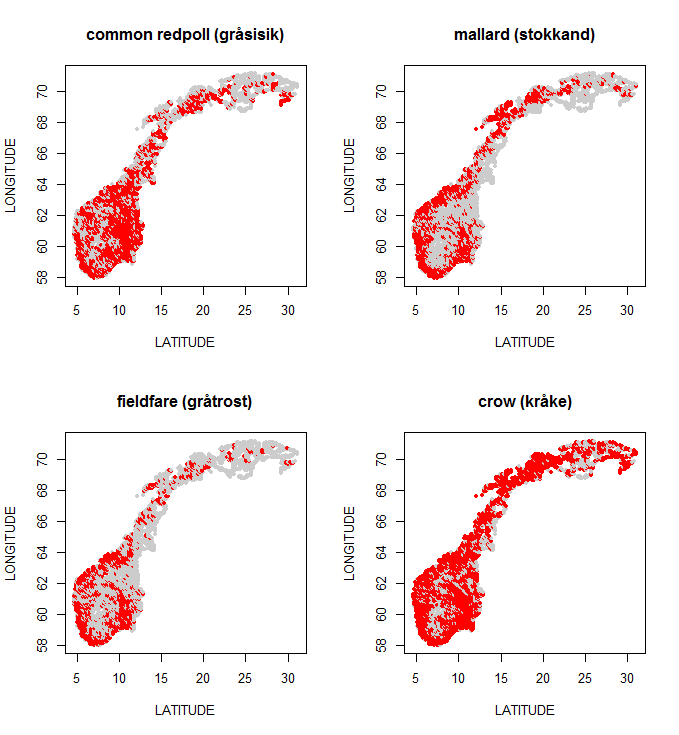

```{r setup, include = FALSE}
knitr::opts_chunk$set(cache = TRUE, echo = TRUE)
library(tidyverse)
library(ggdendro)
library(knitr)
library(BIAS.data)
data(Birds)
#load("C:\\Users\\idsaksei\\OneDrive - Norwegian University of Life #Sciences\\STAT340 V24\\data\\WinterBirds4.RData")
#load("C:\\Users\\idsaksei\\OneDrive - Norwegian University of Life #Sciences\\STAT340 V24\\data\\WinterBirds.RData")
```

Make sure you have installed and loaded the following packages before you start with today's exercises.
```{r libraries, eval = FALSE}
library(tidyverse)
library(ggdendro)
library(ggdendro)
library(BIAS.data)
```

## Exercise 1 - Bird presence \& abundance in Norway

In the figure below, the observed mid-winter abundances of four different birds species have been marked with red colour (source: Jørgensen \& Svorkmo-Lundberg (2006) Norsk vinterfuglatlas). Birds were observed in 10 km^2^ squares accross entire mainland Norway, which was divided into 3163 squares in total. Every square is considered one variable. In this exercise, we will consider the 25 most abundant winter bird species in Norway, starting with the four displayed in the figure. In this exercise, we want to cluster birds into groups based on their geographical distribution during winter using hierarchical clustering methods. Which birds have similar distribution in Norway during winter?

<center>
{#id .class width=75% height=75%}
</center>

We will use data containing maximum abundance measures of each of 25 birds in the 3163 squares. The value reflects the largest simultaneous count of a given bird species in a square region.

a) Below there are three tables. In the table on top are the Euclidean distances between the abundance measures for the four species, A--D, shown in the figure above. The second table is the table after merging species C and D into the first cluster (called C/D). Use the single linkage method to fill in the missing distances in this table. Finally, there is a 2 × 2 table at the bottom for the second clustering iteration. Write down the table and fill in the missing "cluster names" (?/?) as well as the missing distances (`NA`).

   Before the 1^st^ iteration:

```{r iter1, eval = TRUE, echo = FALSE, indent = "   ", fig.align = "center", rows.print = 5}
d <- matrix(c(0, 125.2, 129.0, 126.3, 125.2, 0, 106.7, 126.3, 129.0, 106.7, 0, 96.7, 126.3, 126.3, 96.7, 0), nrow = 4, ncol = 4, byrow = TRUE)
rownames(d) <- c("A", "B", "C", "D")
colnames(d) <- rownames(d)
knitr::kable(d)
```

   After the 1^st^ iteration:

```{r iter2, eval = TRUE, echo = FALSE, indent = "   ", fig.align = "center", rows.print = 5}
d <- matrix(c(rep(NA, 9)), nrow = 3, ncol = 3)
rownames(d) <- c("A", "B", "C/D")
colnames(d) <- rownames(d)
knitr::kable(d)
```

   After the 2^nd^ iteration:
   
```{r iter3, eval = TRUE, echo = FALSE, indent = "   ", fig.align = "center", rows.print = 5}
d <- matrix(rep(NA, 4), nrow = 2, ncol = 2)
rownames(d) <- rep("?/?", 2)
colnames(d) <- rownames(d)
knitr::kable(d)
```

b) Sketch the corresponding dendrogram for this hierachical clustering.

c) Load the data for the four most common birds using `data(Birds4)` and run hierarchical clustering with single linkage and Euclidean distances. Plot the dendrogram. This should yield the same dendrogram as the one you sketched in exercise b).

```{r hclust1, eval = FALSE, echo = TRUE, indent = "   ", fig.align = "center", rows.print = 5}
data(Birds4)

edistBirds4 <- dist(Birds4, method = "euclidean")     # calculating an Euclidean distance matrix
clustBirds4 <- hclust(edistBirds4, method = "single") # hierachical clustering with single linkage

# Plot dendrogram using the base R package
plot(clustBirds4, hang = -1, main = "Single linkage", xlab = "", sub = "")

# Plot dendrogram using the ggdendro package
ggdendrogram(clustBirds4, rotate = TRUE)
```

   Use the results from here to check your answer in exercise a).

   * The distance matrix `round(edistBirds4, digits = 1)` is equivalent to the table that you started with (before the first iteration). 
   * The distances between the clusters are stored in the `height` element of the dendrogram. You can retrieve it with the command `round(clustBirds4$height, digits = 1)`.


d) Load the file `data(Birds)` containing data for 25 bird species. Compute a Euclidean distance matrix and compare different linkage methods.

   Creating the distance matrix with `dist`
```{r dist2, eval = TRUE, echo = TRUE, indent = "   ", fig.align = "center"}
edistBirds <- dist(Birds, method = "euclidean")
```

   We will plot with `ggdendro`, which allows us to rotate the dendrogram and thus make it more reader-friendly.
   
   Single linkage: 
```{r hclust2a, eval = FALSE, echo = TRUE, indent = "   ", fig.align = "center"}
clustBirds.sin <- hclust(edistBirds, method = "single")

ggdendrogram(clustBirds.sin, rotate = TRUE) + ggtitle("Single linkage")
```

   Complete linkage:
```{r hclust2b, eval = FALSE, echo = TRUE, indent = "   ", fig.align = "center"}
clustBirds.com <- hclust(edistBirds, method = "complete")

ggdendrogram(clustBirds.com, rotate = TRUE) + ggtitle("Complete linkage")
```

   Average linkage:
```{r hclust2c, eval = FALSE, echo = TRUE, indent = "   ", fig.align = "center"}
clustBirds.avg <- hclust(edistBirds, method = "average")

ggdendrogram(clustBirds.avg, rotate = TRUE) + ggtitle("Average linkage")
```

e) Repeat exercise d) with average linkage, but change the distance method from Euclidean to Manhattan. Compare the two average linkage dendrograms. Does the grouping change much?

```{r hclust3, eval = FALSE, echo = TRUE, indent = "   ", fig.align = "center"}
# Computing a Manhattan distance matrix.
mdistBirds <- dist(Birds, method = "manhattan")

# Hierachical clustering with average linkage.
clustBirds.avg.m <- hclust(mdistBirds, method = "average")

# Plot the plot!
ggdendrogram(clustBirds.avg.m, rotate = TRUE) + ggtitle("Average linkage, manhattan distance")
```

f) Let's return to the research question: which birds have similar distribution in Norway during winter? How does your answer depend on linkage method and distance measure?

g) You can read about other distance measures in the help file for distance measures in `R`. Write `?dist` in the console window and press enter. For instance, under **Details** you can read about "binary" distance. What do you think, does binary distance measure *abundance* or *occurrence* distances between the birds?

```{r hclust4, eval = FALSE, echo = TRUE, indent = "   ", fig.align = "center"}
bdistBirds <- dist(Birds, method = "binary") # change this to compute a binary distance matrix

clustBirds.avg.b <- hclust(bdistBirds, method = "average") %>%
   ggdendrogram(rotate = TRUE) + ggtitle("Binary distance & average linkage")

clustBirds.avg.b
```
