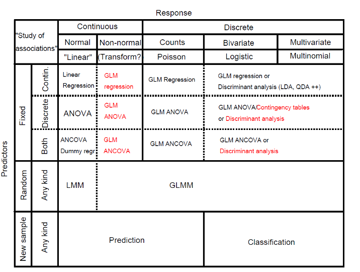
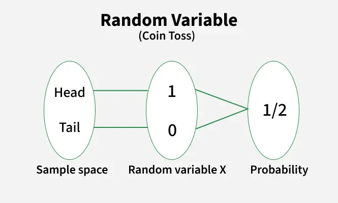
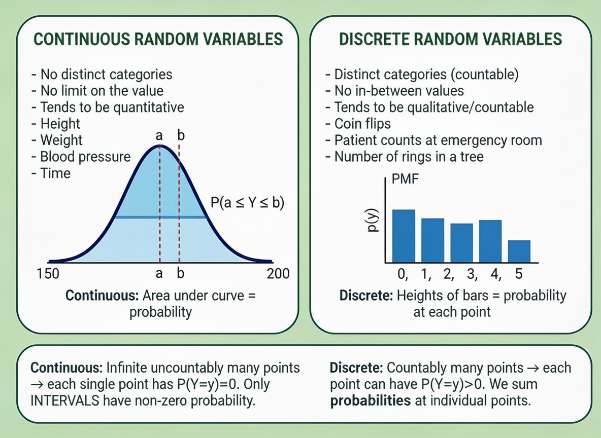
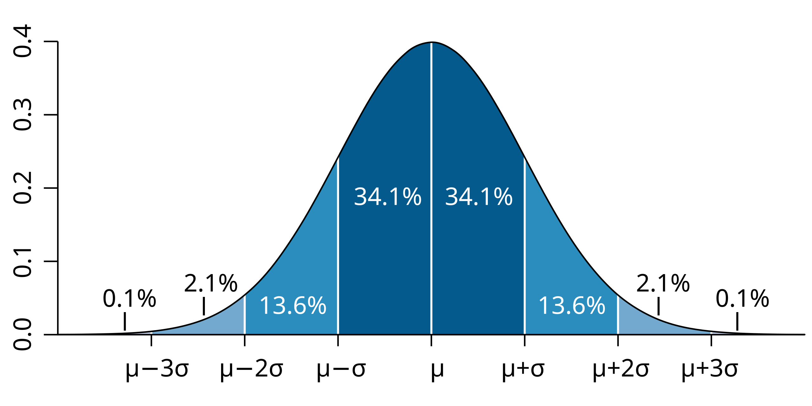
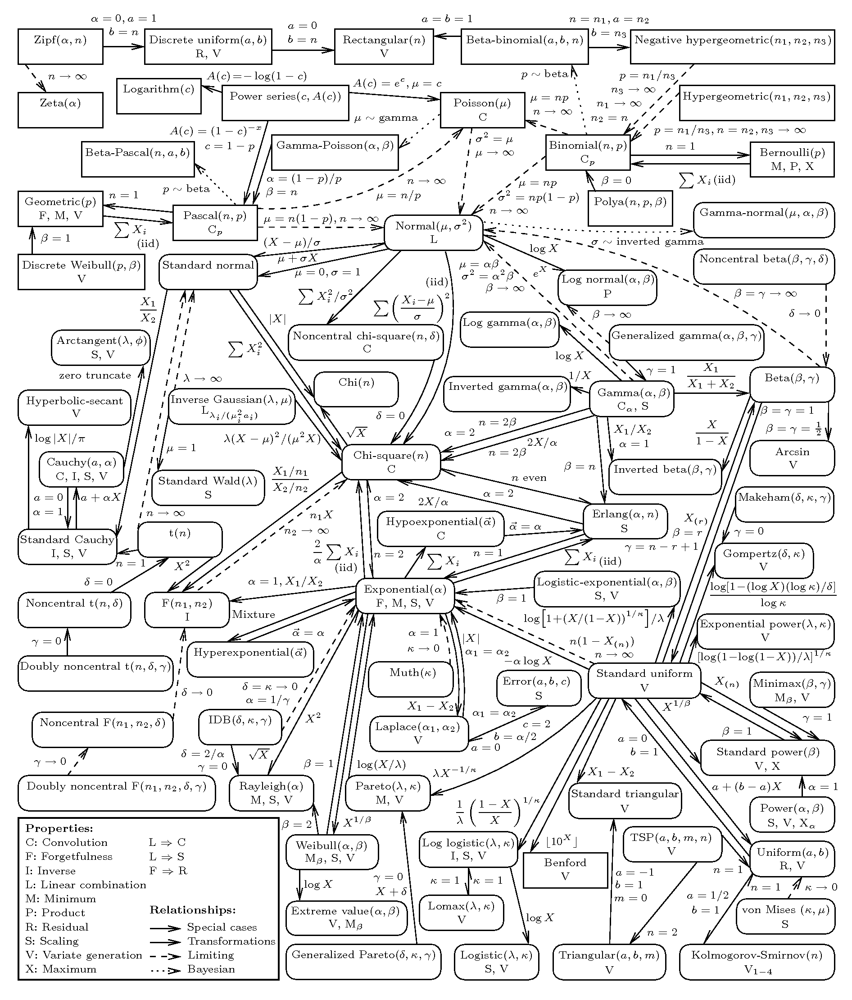

```{r setup, include=FALSE}
knitr::opts_chunk$set(echo = TRUE)
```

# STAT 340 - Introduction

**Applied Methods in Statistics**

**Lecturer:** Ass. Prof. Aliaksandr Hubin, KBM\
**Assistant Teacher:** Elias Bye Rossetnes

**Date:** 03.02.2025\
**Institution:** NMBU - Norges miljø- og biovitenskapelige universitet

------------------------------------------------------------------------

# Course Teachers

## Lecturer

**Ass. Prof. Aliaksandr Hubin, KBM** - Office: M252 - Old diary science
building (Meieribygningen)

-   Email:
    [aliaksandr.hubin\@nmbu.no](mailto:aliaksandr.hubin@nmbu.no){.email}

## Assistant Teacher

**Elias Bye Rossetnes**

------------------------------------------------------------------------

# Class Schedule

## Lectures

-   **When:** Tuesdays 14:15--16:00
-   **Where:** Room T330
-   **First Lecture:** Feb 3

## Exercises (individual work)

-   **When:** Thursdays 14:15--16:00
-   **Where:** Room BT3A10
-   **First Session:** Feb 5

## Exercises (solutions presentation)

-   **When:** Mondays 10:15--12:00
-   **Where:** Room T132
-   **First Session:** Feb 9

------------------------------------------------------------------------

# Practical Information

## Mandatory Activity

-   **Four compulsory quiz assignments**
-   You can be released from a quiz by answering 10 questions correctly
    during lectures (no penalty for wrong answers).
-   This will work even after failing a quiz.

## Exam

-   **Format:** Multiple choice (100%)
-   **Grading:** A--E or Not Passed
-   **Allowed:** All calculators and specified **written** aids
-   **Date & Time:** **May 18, 09:00--12:00**
-   **Important:** No date changes possible

------------------------------------------------------------------------

# Learning Activities (Weekly)

-   **Lectures:** 2 hours
-   **Group Exercises:** 2 hours
-   **Individual Work:** 2 hours

**Total:** 6 hours per week

------------------------------------------------------------------------

# Assumed Background: STAT 100

Students should be familiar with:

-   Basic rules of probability (we shall repeat that today)
-   Common probability distributions (we shall repeat that today):
    -   Binomial
    -   Gaussian (Normal)
    -   Student's t
    -   Fisher's F
-   Hypothesis testing:
    -   One-sample t-tests
    -   Two-sample t-tests
    -   Paired sample t-tests
-   One-way Analysis of Variance (ANOVA)
-   Simple linear regression (one predictor variable)
-   Contingency tables

------------------------------------------------------------------------

# Software & Data

## Software

-   **R Studio** for R programming language
-   Practical analysis using various statistical methods
-   Theoretical and practical interpretation of results
-   (Other software may be used if methods are available)

## Data

-   Mainly R library: **BIAS.data** (GitHub)
    <https://github.com/thoree/BIAS.data>

------------------------------------------------------------------------

# STAT 340 Course Content

## Main Topics

1.  **Introduction to R and RStudio**

    -   Practical analysis using various statistical methods

2.  **Multiple Linear Regression**

3.  **Multivariate Analysis**

    -   Principal Component Analysis (PCA)

4.  **Classification Methods**

5.  **Clustering Methods**

6.  **Generalized Linear Models (GLM)**

    -   Binomial/Bernoulli (logistic) regression
    -   Poisson regression
    -   Mixed models (GLMM): Random effects, repeated measurements

------------------------------------------------------------------------

# Required Learning Resources

## Primary Materials

-   **Lecture presentations** (provided)
-   **All exercises** (provided)

## Recommended Textbooks (available online)

**Main Reference:** - **R Book:** Michael J Crawley, Wiley (2nd ed.) -
Chapters: 1--9 (as needed), 10--13, 17, 19, 25 - Freely available
<https://www.cs.upc.edu/~robert/teaching/estadistica/TheRBook.pdf>

**Supplementary (mathematical details):** - **ISL:** James et al. \`\`An
Introduction to Statistical Learning'' - Chapters: 1--4, 6.1, 7.1, 10 -
Freely available <https://www.statlearning.com>

------------------------------------------------------------------------

# Typical Week Structure

{width="400"}

------------------------------------------------------------------------

# {width="524"}

------------------------------------------------------------------------

# Reflection Activity

**Turn to your neighbour(s) and discuss:**

-   Do you know what kind of **data** you will be dealing with in your
    work?
-   Do you have any idea what **association studies** or **methods** are
    relevant for your research?
-   Are they mentioned in the table in the previous page?

------------------------------------------------------------------------

# Now, Let's Begin!

## Lecture 1, Part B: Review of Basic Statistics

We'll start with basics of **probability theory** - the mathematical
foundation for **uncertainty** and **statistical inference**.

------------------------------------------------------------------------

# Part 0: Foundations of Probability

# Setting Up a Random Experiment

Before studying random variables, we need to define randomness formally.

**A probability setup has three components:**

1.  **Sample space** $\Omega$: all possible outcomes
    -   *Discrete:* Coin flip: $\Omega = \{\text{H}, \text{T}\}$
    -   *Continuous:* Adult height: $\Omega = [120, 250] \text{ cm}$
2.  **Events** $\mathcal{F}$: subsets of outcomes we observe
    -   *Discrete:* $\{\text{H}\}$ = \`\`heads''
    -   *Continuous:* $\{h : 175.3\}$
3.  **Probabilities** $P$: assigns to events a number in $[0,1]$
    -   *Discrete:* $P(\text{H}) = 0.5$
    -   *Continuous:* $P(160 \leq h \leq 180) = 0.68$

Together: $(\Omega, \mathcal{F}, P)$ is a **probability space**.

# Andrey Kolmogorov (1903–1987)

{width="65"}

-   Established the **foundations of probability** (1933) through
    measure theory

-   Formalized the concept of probability space
    $(\Omega, \mathcal{F}, P)$ that we use today.

**Kolmogorov's Axioms** (the foundation of modern probability): 1.
$P(\Omega) = 1$ (certainty has probability 1) 2. $P(A) \geq 0$ for all
outcomes $A$ (non-negativity) 3. Countable additivity: If
$A_1, A_2, \ldots$ are disjoint events, then
$P(\bigcup_i A_i) = \sum_i P(A_i)$

------------------------------------------------------------------------

# Part 1: Random Variables

# What is a Random Variable?

A **random variable** is a function that assigns a numeric value to each
outcome in the sample space. Maps from experiment sample space to a real
space.

**Why?** Numbers let us compute statistics: averages, spreads, and
patterns.

{width="241"}

**Example:** Coin flip outcome $\to$ Number: - Heads $\to Y = 1$ - Tails
$\to Y = 0$

------------------------------------------------------------------------

# Discrete vs. Continuous Random Variables

{width="351"}

------------------------------------------------------------------------

# Discrete Random Variables

-   **Countable** values (often integers)

-   Examples: Coin flips, patient counts at emergency room, number of
    rings in a tree

-   Use **probability mass function (PMF)** $p(y)$: $P(Y = y) = p(y)$
    and $\sum_{\text{all } y} p(y) = 1$

-   **Cumulative distribution function (CDF):**
    $F(y) = P(Y \leq y) = \sum_{x \leq y} p(x)$

-   Also exist quantile functions, moment generating functions,
    characteristic functions (beyond this course).

------------------------------------------------------------------------

# Continuous Random Variables

-   Values in an **interval** (uncountably many)

-   Examples: Height, weight, blood pressure, time

-   Use **probability density function (PDF)** $f(y)$

-   Probabilities: $P(a \leq Y \leq b) = \int_a^b f(y) \, dy$ and

    $\int_{-\infty}^{\infty} f(y) \, dy = 1$

-   **Cumulative distribution function (CDF):**
    $F(y) = P(Y \leq y) = \int_{-\infty}^y f(x) \, dx$

------------------------------------------------------------------------

# CRITICAL DIFFERENCE: Single Point Probability

**CHECKPOINT: Why does P(Y = 172.5) = 0 for continuous height?**

| Property                | Discrete        | Continuous                 |
|-------------------------|-----------------|----------------------------|
| $P(Y = y)$              | **Can be \> 0** | **Always = 0**             |
| Example: Fair die       | $P(Y=3) = 1/6$  | —                          |
| Example: Height         | —               | $P(\text{height}=172.5)=0$ |
| How to find probability | Use $P(Y=y)$    | Use $P(a \leq Y \leq b)$   |

**Intuition:** Continuous distributions have *uncountably many* points
(infinity!), so each single point contributes zero probability.

Only **intervals with area** have non-zero probability.

------------------------------------------------------------------------

```{r, echo=FALSE, fig.height=2.8, fig.width=8}
par(mfrow=c(2,2), mar=c(3,3,2.5,1))

# Discrete PMF
y_vals <- 0:5
pmf_vals <- dbinom(y_vals, size=5, prob=0.5)
barplot(pmf_vals, names.arg=y_vals, ylim=c(0, 0.35), 
        main='Discrete: PMF', ylab='p(y)', xlab='y', 
        col='steelblue', space=0.3, cex.axis=0.9)


# Discrete CDF
cdf_vals <- pbinom(y_vals, size=5, prob=0.5)
plot(y_vals, cdf_vals, type='s', lwd=2.5, col='darkblue',
     main='Discrete: CDF', ylab='F(y)', xlab='y', 
     ylim=c(0, 1), pch=16, cex=0.8, cex.axis=0.9)
mtext('P(Y ≤ y) — Jumps at points', side=2, line=2, cex=0.8)

# Continuous PDF
curve(dnorm(x, 5, 1.5), xlim=c(1, 9), ylim=c(0, 0.3),
      main='Continuous: PDF', ylab='f(y)', xlab='y',
      lwd=2.5, col='darkred', cex.axis=0.9)


# Continuous CDF
curve(pnorm(x, 5, 1.5), xlim=c(1, 9), ylim=c(0, 1),
      main='Continuous: CDF (Normal)', ylab='F(y)', xlab='y',
      lwd=2.5, col='darkred', cex.axis=0.9)
mtext('P(Y ≤ y) — Smooth curve', side=2, line=2, cex=0.8)

par(mfrow=c(1,1))
```

**Key insight:** PMF and PDF describe probability distributions; CDF
accumulates probabilities up to a point.

------------------------------------------------------------------------

# Part 2: Probability Distributions

# Probability Density Function (Continuous)

For a **continuous** $Y$ with density $f(y)$:

$$f(y) \geq 0 \quad \text{for all } y \quad ; \quad \int_{-\infty}^{\infty} f(y) \, dy = 1$$

For any interval $[a, b]$:
$$P(a \leq Y \leq b) = \int_{a}^{b} f(y) \, dy \quad \text{(shaded area below)}$$

```{r, echo=FALSE, fig.height=2.4, fig.width=6}
par(mfrow=c(1,2), mar=c(3,3,2.5,1))

# Normal distribution with shaded area
curve(dnorm(x), xlim=c(-4, 4), ylim=c(0.015, 0.45), ylab='f(y)', xlab='y',
      main='Normal: P(a ≤ Y ≤ b)', lwd=2.5, col='black')
x_fill <- seq(-1.5, 0.5, length.out=100)
polygon(c(-1.5, x_fill, 0.5), c(0, dnorm(x_fill), 0), 
        col=rgb(0.2, 0.5, 1, 0.5))
abline(v=c(-1.5, 0.5), col='red', lwd=1.5, lty=2)
#text(-0.5, 0.25, 'Area = P(a ≤ Y ≤ b)', cex=0.85, col='darkblue', font=2)

# Chi-square distribution with shaded area
curve(dchisq(x, df=5), xlim=c(0, 15), ylim=c(0.015, 0.25), ylab='f(y)', xlab='y',
      main='Chi-Square: P(a ≤ Y ≤ b)', lwd=2.5, col='darkred')
x_fill2 <- seq(2, 8, length.out=100)
polygon(c(2, x_fill2, 8), c(0, dchisq(x_fill2, df=5), 0), 
        col=rgb(1, 0.3, 0.2, 0.5))
abline(v=c(2, 8), col='red', lwd=1.5, lty=2)
#text(5, 0.15, 'Area = P(a ≤ Y ≤ b)', cex=0.85, col='darkred', font=2)

par(mfrow=c(1,1))
```

**Key insight:** Probability = area under density curve!

------------------------------------------------------------------------

# Part 3: Expectation and Variance

# Expectation: Discrete Case

For a **discrete** $Y$ with probabilities $p(y)$:

$$E(Y) = \mu = \sum_{\text{all } y} y \cdot p(y)$$

**Fair die example** ($\{1,2,3,4,5,6\}$, each with $p(y) = 1/6$):
$$E(Y) = 1 \cdot \frac{1}{6} + 2 \cdot \frac{1}{6} + \cdots + 6 \cdot \frac{1}{6} = 3.5$$

**Interpretation:** Long-run average over many rolls.

------------------------------------------------------------------------

# CHECKPOINT: Understanding E(Y) for the Fair Die

**Question:** Why is $E(Y) = 3.5$, not 3 or 4? What does 3.5 mean?

-   Is 3.5 a possible outcome when rolling a die? **NO**
-   Does it mean we expect to see 3.5 on the next roll? **NO**
-   Does it mean over 1,000 rolls, the average is *approximately* 3.5?
    **YES**

**Key insight:** $E(Y)$ is the **balance point** of the distribution.
Imagine the die outcomes as weights on a seesaw—3.5 is where it
balances!

------------------------------------------------------------------------

# Expectation: Continuous Case

For a **continuous** $Y$ with density $f(y)$:

$$E(Y) = \mu = \int_{-\infty}^{\infty} y \, f(y) \, dy$$

**Interpretation:** Center of mass (balance point) of the distribution.

```{r, echo=FALSE, fig.height=2.8, fig.width=6}
par(mfrow=c(1,2), mar=c(3,3,2,1))

# Normal distribution
curve(dnorm(x, 8, 2), xlim=c(2, 14), ylab='f(y)', xlab='y',
      main='N(8, 4): E(Y)=8', lwd=2.5, col='navy')
abline(v=8, col='red', lwd=2.5, lty=2)
text(8.3, 0.18, 'E(Y)', cex=0.9, col='red', font=2)

# Chi-square distribution
curve(dchisq(x, df=8), xlim=c(0, 25), ylab='f(y)', xlab='y',
      main='xi²(8): E(Y)=8', lwd=2.5, col='darkgreen')
abline(v=8, col='red', lwd=2.5, lty=2)
text(8.3, 0.08, 'E(Y)', cex=0.9, col='red', font=2)

par(mfrow=c(1,1))
```

------------------------------------------------------------------------

# Variance: Discrete Case

For a **discrete** $Y$:

$$Var(Y) = \sigma^2 = E((y-\mu)^2) = \sum_{\text{all } y} (y - \mu)^2 \cdot p(y)$$

**Fair die with** $\mu = 3.5$:
$$Var(Y) = (1-3.5)^2 \cdot \frac{1}{6} + \cdots + (6-3.5)^2 \cdot \frac{1}{6} \approx 2.92$$

------------------------------------------------------------------------

# Variance: Continuous Case

For a **continuous** $Y$:

$$Var(Y) = \sigma^2 = \int_{-\infty}^{\infty} (y - \mu)^2 f(y) \, dy$$

**Standard deviation:** $\sigma = \sqrt{Var(Y)}$ (same units as $Y$)

```{r, echo=FALSE, fig.height=2.8, fig.width=6}
par(mfrow=c(1,2), mar=c(3,3,2,1))

# Small variance
curve(dnorm(x, 10, 1.5), xlim=c(5, 15), ylim=c(0, 0.3), ylab='f(y)', xlab='y',
      main='N(10, 2.25): Var = 2.25', lwd=2.5, col='darkblue')
abline(v=c(8.5, 11.5), col='darkblue', lwd=1, lty=3)
text(10, 0.25, 'Concentrated', cex=0.85, col='darkblue', font=2)

# Large variance
curve(dnorm(x, 10, 3.5), xlim=c(5, 15), ylim=c(0, 0.3), ylab='f(y)', xlab='y',
      main='N(10, 12.25): Var = 12.25', lwd=2.5, col='darkred')
abline(v=c(6.5, 13.5), col='darkred', lwd=1, lty=3)
text(10, 0.25, 'Dispersed', cex=0.85, col='darkred', font=2)

par(mfrow=c(1,1))
```

**Larger variance = more spread!**

------------------------------------------------------------------------

# CHECKPOINT: Practical Variance Interpretation

**Question:** Which is less risky: Stock A with $\sigma^2 = 4$ or Stock
B with $\sigma^2 = 16$?

-   Stock A: $\sigma = 2$ (tightly concentrated returns)?
-   Stock B: $\sigma = 4$ (widely dispersed returns)?

**Key lesson:** Variance = **spread of outcomes**. Smaller variance =
more predictable!

------------------------------------------------------------------------

# Part 4: Sample Statistics

# Sample Mean and Standard Deviation

Given $n$ observations $y_1, \ldots, y_n$:

**Sample mean** (estimates $\mu$):
$$\bar{y} = \frac{1}{n} \sum_{t=1}^n y_t$$

**Sample standard deviation** (estimates $\sigma$):
$$s = \sqrt{\frac{1}{n-1} \sum_{t=1}^n (y_t - \bar{y})^2}$$

We divide by $(n-1)$ for unbiased variance estimation (**Bessel's
correction**).

------------------------------------------------------------------------

# Part 5: Rules for Transformations

# Linear Transformations: $E(cY)$ and $Var(cY)$

For constant $c$ and random variable $Y$:

$$E(c) = c, $$ $$E(cY) = c \cdot E(Y)$$ $$Var(c) = 0,$$
$$ Var(cY) = c^2 \cdot Var(Y)$$

**Key insight:** Variance scales with $c^2$. Doubling a variable
multiplies variance by 4!

------------------------------------------------------------------------

# CHECKPOINT: can someone say how to prove Var(cY) = c²Var(Y), not cVar(Y)?

**Question:** If we triple the values (multiply by 3), variance
multiplies by 9. Why the square?

------------------------------------------------------------------------

# Sums of Independent Variables

For independent $Y_1, \ldots, Y_n$ with expectations $\mu_i$ and
variances $\sigma_i^2$ and some constants \$c_i\$:

**Expectation of sum:**
$$E\left(\sum_{i=1}^n c_iY_i\right) = \sum_{i=1}^n c_i\mu_i$$

**Variance of sum (independent only):**
$$Var\left(\sum_{i=1}^n c_iY_i\right) = \sum_{i=1}^n c_i^2\sigma_i^2$$

------------------------------------------------------------------------

# Part 6: Key Distributions

# The Normal Distribution

**Notation:** $Y \sim N(\mu, \sigma^2)$

**PDF:**
$f(y) = \frac{1}{\sigma\sqrt{2\pi}} \exp\left\{-\frac{1}{2}\left(\frac{y-\mu}{\sigma}\right)^2\right\}$

**Empirical Rule & Visual:**
{width="340"}

------------------------------------------------------------------------

# CHECKPOINT: SAT Scores and the 68-95 Rule

**Application:** SAT scores follow $N(\mu=500, \sigma=100)$.

-   What % score between **400-600**? (within 1 standard deviation)

-   What % score between **300-700**? (2 standard deviations away from
    mean)

------------------------------------------------------------------------

# CHECKPOINT: SAT Scores and the 68-95 Rule

**Application:** SAT scores follow $N(\mu=500, \sigma=100)$.

-   What % score between **400-600**? (within 1 standard deviation)
    -   **Answer: 68.2%**
-   What % score between **300-700**? (2 standard deviations away from
    mean)
    -   **Answer: 95.4%**

**Why this matters:** Standardized tests are designed using normal
distributions. Knowing the 68-95 rule helps interpret scores!

------------------------------------------------------------------------

# Carl Friedrich Gauss (1777–1855)

**The "Prince of Mathematicians"** and namesake of the normal
distribution.

{width="164"}

-   Developed the **normal distribution** and **method of least
    squares** (circa 1809!)
-   Used statistics to model astronomical observations, revolutionizing
    scientific practice
-   Discovered that many natural measurements follow the bell-shaped
    curve

**Legacy:** The normal distribution is also called the **Gaussian
distribution** in his honor

# Linear Combinations of Normal Variables

If $Y_1 \sim N(\mu_1, \sigma_1^2)$ and $Y_2 \sim N(\mu_2, \sigma_2^2)$
are *independent*:

$$aY_1 + bY_2 \sim N(a\mu_1 + b\mu_2, \, a^2\sigma_1^2 + b^2\sigma_2^2)$$

This is **fundamental** for inference about sample means and regression.

------------------------------------------------------------------------

# The Chi-Square Distribution

**Notation:** $Y \sim \chi^2_k$ where $k$ = degrees of freedom

**Key derivation:** $Z^2 \sim \chi^2_1$ if $Z \sim N(0,1)$; additive
property: $\sum_{i=1}^k Z_i^2 \sim \chi^2_k$

**Properties:** $E(Y) = k$, $Var(Y) = 2k$

```{r, echo=FALSE, fig.height=2.8, fig.width=6}
par(mfrow=c(1,2), mar=c(3,3,2,1))

curve(dchisq(x, df=3), xlim=c(0, 15), ylim=c(0, 0.35), ylab='f(y)', xlab='y',
      main='Chi-Square shapes', lwd=2.5, col='darkred')
curve(dchisq(x, df=8), xlim=c(0, 15), ylim=c(0, 0.35), lwd=2.5, col='darkgreen', add=TRUE)
curve(dchisq(x, df=15), xlim=c(0, 15), ylim=c(0, 0.35), lwd=2.5, col='navy', add=TRUE)
legend('topright', legend=c('k=3', 'k=8', 'k=15'), col=c('darkred', 'darkgreen', 'navy'),
       lwd=2.5, cex=0.8)

par(mfrow=c(1,1))
```

------------------------------------------------------------------------

# The Student's $t$ Distribution

**Definition:** For independent $Z \sim N(0,1)$ and $\chi^2_k$:

$$T = \frac{Z}{\sqrt{\chi^2_k / k}} \sim t_k$$

```{r, echo=FALSE, fig.height=2.6, fig.width=6}
par(mfrow=c(1,2), mar=c(3,3,2,1))

# Small df (heavy tails)
curve(dt(x, df=3), xlim=c(-5, 5), ylim=c(0, 0.42), ylab='f(y)', xlab='y',
      main='t-distribution with small df', lwd=2.5, col='darkred')
curve(dnorm(x), xlim=c(-5, 5), ylim=c(0, 0.42), lwd=2, col='blue', lty=2, add=TRUE)
legend('topright', legend=c('t(3): Heavy tails', 'N(0,1)'), 
       col=c('darkred', 'blue'), lwd=c(2.5, 2), lty=c(1,2), cex=0.8)

# Large df (approaches normal)
curve(dt(x, df=30), xlim=c(-5, 5), ylim=c(0, 0.42), ylab='f(y)', xlab='y',
      main='t-distribution converges to normal', lwd=2.5, col='darkgreen')
curve(dnorm(x), xlim=c(-5, 5), ylim=c(0, 0.42), lwd=2, col='blue', lty=2, add=TRUE)
legend('topright', legend=c('t(30): Almost normal', 'N(0,1)'), 
       col=c('darkgreen', 'blue'), lwd=c(2.5, 2), lty=c(1,2), cex=0.8)

par(mfrow=c(1,1))
```

**Properties:** Symmetric, heavier tails than normal, converges to
$N(0,1)$ as $k \to \infty$

------------------------------------------------------------------------

# William Sealy Gosset (1876–1937): "Student"

**The statistician behind the** $t$ distribution.

-   **English statistician** working as a chemist for Guinness Brewery
-   Faced a practical problem: small sample inference for quality
    control
-   Published under the pseudonym **"Student"** because Guinness forbade
    employee publications
-   Developed the $t$ distribution to handle small samples when variance
    is unknown (1908)

**Key insight:** With small samples, we can't assume the normal
distribution works---we need "Student's $t$" with heavier tails!

------------------------------------------------------------------------

# The $t$ Distribution: Practical Use

**Test statistic for population mean:**

If $Y_1, \ldots, Y_n$ i.i.d. $N(\mu, \sigma^2)$ and
$S^2 = \frac{1}{n-1}\sum_{t=1}^n (Y_t - \bar{Y})^2$:

$$T = \frac{\bar{Y} - \mu}{\sqrt{S^2/n}} \sim t_{n-1}$$

This is the **one-sample** $t$ test statistic.

------------------------------------------------------------------------

# Ronald Aylmer Fisher (1890–1962)

**The founder of modern statistics** and namesake of the $F$
distribution.

-   **British statistician and geneticist** with revolutionary impact on
    statistics and evolutionary biology
-   Invented the **F distribution**, **ANOVA** (analysis of variance),
    and **maximum likelihood estimation**
-   Pioneered **experimental design** principles (randomization,
    blocking, replication)
-   Won the prestigious **Weldon Medal** for his contributions to
    statistical science

**Legacy:** Fisher's work transformed statistics from a descriptive tool
to a framework for scientific inference. His "Lady Tasting Tea"
experiment is a classic example!

------------------------------------------------------------------------

# The $F$ Distribution

**Notation:** $Y \sim F_{u,v}$ where $u, v$ = degrees of freedom

**Definition:** For independent $\chi^2_u$ and $\chi^2_v$:

$$F = \frac{\chi^2_u / u}{\chi^2_v / v} \sim F_{u,v}$$

```{r, echo=FALSE, fig.height=2.8, fig.width=6}
par(mfrow=c(1,2), mar=c(3,3,2,1))

curve(df(x, df1=5, df2=10), xlim=c(0, 6), ylim=c(0, 1.2), ylab='f(y)', xlab='y',
      main='F(5, 10): Right-skewed', lwd=2.5, col='darkred')
curve(df(x, df1=20, df2=20), xlim=c(0, 6), ylim=c(0, 1.2), ylab='f(y)', xlab='y',
      main='F(20, 20): More symmetric', lwd=2.5, col='darkgreen', add=TRUE)
legend('topright', legend=c('F(5,10)', 'F(20,20)'), 
       col=c('darkred', 'darkgreen'), lwd=2.5, cex=0.8)

curve(df(x, df1=10, df2=5), xlim=c(0, 6), ylim=c(0, 1.2), ylab='f(y)', xlab='y',
      main='F-distributions with different df', lwd=2.5, col='navy')
curve(df(x, df1=20, df2=20), xlim=c(0, 6), ylim=c(0, 1.2), lwd=2.5, col='darkred', add=TRUE)
curve(df(x, df1=100, df2=100), xlim=c(0, 6), ylim=c(0, 1.2), lwd=2.5, col='darkgreen', add=TRUE)
legend('topright', legend=c('F(10,5)', 'F(20,20)', 'F(100,100)'), 
       col=c('navy', 'darkred', 'darkgreen'), lwd=2.5, cex=0.8)

par(mfrow=c(1,1))
```

Used for ANOVA and comparing variances (Fisher's major contributions).

------------------------------------------------------------------------

# Many more distributions of course

{width="211"}
