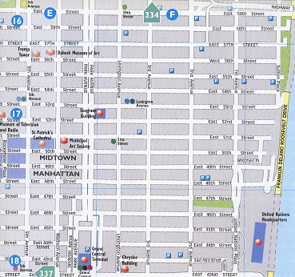
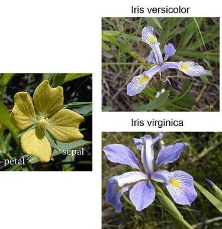
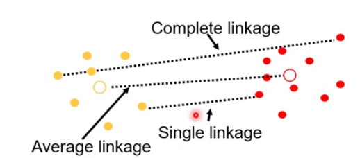

## Chapters for cluster analysis

**ISLR: Chapter 12**: Unsupervised Learning

o   Section 12.4: Clustering Methods

§  Section 12.4.1: K-Means Clustering

§  Section 12.4.2: Hierarchical Clustering

**R Book: Chapter 25**: Multivariate Statistics

o   Section 25.3: Cluster Analysis

§  Section 25.3.1: Partitioning

§  Section 25.3.2: Taxonomic Use of K-means

o   Section 25.4: Hierarchical Cluster Analysis

## Topics for this lecture

-   Cluster analysis
-   Similarity and distance
-   K-means clustering
-   Partitioning Around Medoids (PAM) clustering
-   Hierarchical clustering
-   Case study: Assignment 1

## Cluster analysis

-   Objects belong to some groups or classes
-   Cluster analysis is so-called *Unsupervised learning* of groups
-   Neither the identity nor the number of groups is known
-   Can be a non-parametric (algorithmic) data-driven search - today
-   Or statistical grounded through semi-parametric mixture models -
    advanced
-   Later in the course, we will return to *supervised learning* where
    the identities and number of groups are known (discriminant analysis
    and classification)

## Groups in data

-   A data set with $n$ cases (rows) and $p$ variables
    (columns)$\mathbf{X} =
    \begin{bmatrix}
    x_{11} & \cdots & x_{1p} \\
    \vdots & \vdots & \vdots \\
    x_{n1} & \cdots & x_{np}
    \end{bmatrix}$

-   We look for groups in the data cases

    -   Cases in the same group are «similar»
    -   Cases in different groups are «different»

-   Grouping or similarity is relative to some **similarity** or
    **distance metric**

    -   What do we mean by the «distance» between two points?

## Motivation

-   **Explorative**
    -   A way to «inspect» large data sets
    -   May give you some ideas/hypotheses
    -   May reveal outliers or severe errors in data
-   **Down-sampling**
    -   Each cluster center is a representative of its «region» in the
        data

## Measure of similarity/dissimilarity

We need measures of "distance" between observations

-   Euclidean distance
-   Manhattan distance
-   Minkowski distance
-   Hamming distance (for binary variables)
-   Others

See e.g `?dist` for R help

## A simulated example - Distance between observations?

```{r, echo=FALSE}
set.seed(146)
x1 <- rnorm(25, 5, 2)
x2 <- x1 + rnorm(25, 0, 2)
mycol <- rep("black", 25)
mycol[c(9,11,21)] <- "blue"
plot(x1, x2, pch=20, col=mycol, cex=2)
text(x1,x2, labels=as.character(1:25),pos=2)
```

## Euclidean distance

Euclidean distance is shortest distance on a map

E.g. distance between two observations $(x_{11}, x_{12})$ and
$(x_{21}, x_{22})$

$$D_e = \sqrt{(x_{11} - x_{21})^2 + (x_{12} - x_{22})^2}$$

## Euclidean distance: example

Assume $x_1 = (6.255,5.495), x_2 = (3.919,2.683)$

```{r, echo = F}
# Points (capital X1, X2)
X1 <- c(6.255, 5.495)
X2 <- c(3.919, 2.683)

# Compute Euclidean distance
dist <- sqrt((X1[1] - X2[1])^2 + (X1[2] - X2[2])^2)

# Plot
plot(X1[1], X1[2], pch = 19, col = "red", xlim = c(3, 7), ylim = c(2, 6),
     xlab = "x1", ylab = "x2", main = "d = sqrt((6.255 - 3.919)^2 + (5.495 - 2.683)^2)")
points(X2[1], X2[2], pch = 19, col = "blue")

# Hypotenuse (Euclidean distance)
segments(X1[1], X1[2], X2[1], X2[2], lwd = 3, col = "black")

# Dashed legs of the triangle (Delta x and Delta y)
segments(X1[1], X1[2], X1[1], X2[2], lwd = 2, col = "red", lty = 2)
segments(X1[1], X2[2], X2[1], X2[2], lwd = 2, col = "blue", lty = 2)

# Labels for points
text(X1[1] + 0.25, X1[2], "x1", cex = 1.4, font = 2)
text(X2[1] - 0.25, X2[2], "x2", cex = 1.4, font = 2)

# Distance annotation
text(mean(c(X1[1], X2[1])), mean(c(X1[2], X2[2])) + 1.15,
     sprintf("d = %.4f", dist), cex = 1.3)

# Legend
legend("topleft", legend = c("X1", "X2", "Δy", "Δx", "Euclidean d"),
       col = c("red", "blue", "red", "blue", "black"),
       pch = c(19, 19, NA, NA, NA), lty = c(NA, NA, 2, 2, 1),
       lwd = c(NA, NA, 2, 2, 3), cex = 0.9, bg = "white")
mypoints <- cbind(x1,x2)[c(9,11,21),]
rownames(mypoints) <- as.character(c(9,11,21))
```

## For blue observations no (9, 11 and 21)

```{r, echo=FALSE,fig.width=3.5, fig.height=3.5}
plot(x1, x2, pch=20, col=mycol, cex=2)
text(x1,x2, labels=as.character(1:25),pos=2)
```

```{r, echo=TRUE}
dist(mypoints, method ="euclidean")
```

## Manhattan distance

"Manhattan distance"" is like the walking distance between two shops on
Manhattan

{width="467"}

## Manhattan distance, continued

Manhattan distance between two observations
$x_1 = (6.255,5.495), x_2 = (3.919,2.683)$

$$D_m = |x_{11} - x_{21}| + |x_{12} - x_{22}|$$

```{r, echo=FALSE}
# Points
# Points
X1 <- c(6.255, 5.495)
X2 <- c(3.919, 2.683)

# Distances
eucl_dist <- sqrt((X1[1] - X2[1])^2 + (X1[2] - X2[2])^2)
manh_dist <- abs(X1[1] - X2[1]) + abs(X1[2] - X2[2])
#cat(sprintf("Manhattan distance: %.4f (Euclidean reference: %.4f)\n", manh_dist, eucl_dist))

# Plot
plot(X1[1], X1[2], pch = 19, col = "red", xlim = c(3, 7), ylim = c(2, 6),
     xlab = "x1", ylab = "x2", main = "manh_dist = abs(X1[1] - X2[1]) + abs(X1[2] - X2[2])")
points(X2[1], X2[2], pch = 19, col = "blue")

# Euclidean reference (dashed black)
segments(X1[1], X1[2], X2[1], X2[2], lwd = 2, col = "black", lty = 2)

# Manhattan lower path focus (solid red: horizontal then vertical)
segments(X2[1], X2[2], X1[1], X2[2], lwd = 4, col = "red")
segments(X1[1], X2[2], X1[1], X1[2], lwd = 4, col = "red")


# Labels
text(X1[1] + 0.25, X1[2], "X1", cex = 1.4, font = 2)
text(X2[1] - 0.25, X2[2], "X2", cex = 1.4, font = 2)

# Annotations (focus on Manhattan)
text(X1[1] - 0.25, (X1[2] + X2[2])/2, sprintf("Manhattan\nL1 = %.4f", manh_dist), cex = 1.2, adj=1)
text((X1[1] + X2[1])/2, (X1[2] + X2[2])/2 + 1.05, sprintf("Euclidean\nL2 = %.4f", eucl_dist), cex = 1.1)

# Legend (Manhattan primary)
legend("topleft", c("X1", "X2", "Manhattan L1 (solid)", "Euclidean L2 (dashed)"),
       col = c("red", "blue", "red", "black"),
       pch = c(19, 19, NA, NA), lty = c(NA, NA, 1, 2),
       lwd = c(NA, NA, 4, 2), cex = 0.9, bg = "white")


```

## Manhattan distance for blue points:

```{r, echo=FALSE,fig.width=4, fig.height=4}
plot(x1, x2, pch=20, col=mycol, cex=2)
text(x1,x2, labels=as.character(1:25),pos=2)
```

```{r, echo=FALSE}
dist(mypoints, method ="manhattan")
```

## Minkowski distance

For two points $\mathbf{x}_1 = (x_{11},\dots,x_{1p})$ and
$\mathbf{x}_2 = (x_{21},\dots,x_{2p})$, the **Minkowski distance** of
order $r \ge 1$ is $$
d_r(\mathbf{x}_1, \mathbf{x}_2) =
\left( \sum_{j=1}^p |x_{1j} - x_{2j}|^r \right)^{1/r}.
$$

-   **Manhattan distance** ($r = 1$):
    $d_1(\mathbf{x}_1, \mathbf{x}_2) = \sum_{j=1}^p |x_{1j} - x_{2j}|$

-   **Euclidean distance** ($r = 2$):
    $d_2(\mathbf{x}_1, \mathbf{x}_2) = \sqrt{\sum_{j=1}^p (x_{1j} - x_{2j})^2}$

-   Larger $r$ values give more weight to large coordinate differences.

## Hamming distance

For two **binary** vectors $\mathbf{x}_1, \mathbf{x}_2 \in \{0,1\}^p$ of
the same length, the **Hamming distance** counts how many positions
differ: $$
d_H(\mathbf{x}_1, \mathbf{x}_2) = \#\{j : x_{1j} \ne x_{2j}\}.
$$

**Example** (differences highlighted in red):

$$
\mathbf{x}_1 = \left( \color{red}{1},\, 0,\, \color{red}{1},\, 0 \right), \quad
\mathbf{x}_2 = \left( \color{red}{0},\, 0,\, \color{red}{0},\, 0 \right)
$$

Positions 1 and 3 differ, so $d_H(\mathbf{x}_1, \mathbf{x}_2) = 2$.

-   Used for **categorical** or **binary** variables (e.g., gene
    sequences, binary features).
-   Related to the number of bit flips needed to transform one vector
    into the other.

## Iris data

Goal: Group together objects that are similar

{width="391"}

## The famous "Iris" data set

-   This famous (Fisher's or Anderson's) iris data set gives the
    measurements in centimeters of the variables X1=sepal length,
    X2=sepal width, X3=petal length and X4=petal width, respectively.

```{r, echo=FALSE, message=FALSE}
data(iris)
head(iris[c(1:3,55:57,125:127),1:5],8)
```

-   Question: Are there many species of iris? which are which? (if we
    did not know the truth)

## Sepal vs petal length/width

-   Are there detectable clusters in the data?

```{r, echo=FALSE}
par(mfrow=c(1,2))
plot(Sepal.Length ~ Petal.Length, data=iris, pch=20)
plot(Sepal.Width ~ Petal.Width, data=iris, pch=20)
```

## For these data we know...

```{r, echo=FALSE}
par(mfrow=c(1,2))
cols=factor(iris$Species, labels = 1:3)
plot(Sepal.Length ~ Petal.Length, data=iris, pch=20, col=cols)
plot(Sepal.Width ~ Petal.Width, data=iris, pch=20, col=cols)
```

## K-means clustering

-   Distribute the observations into $K$ clusters so that the
    **within-cluster** dissimilarity (from **Euclidean distance**) is
    minimized.

-   For cluster $C_k$, the within-cluster sum of squared distances is $$
    W(C_k) = \sum_{\mathbf{x}_i \in C_k} d^2(\mathbf{x}_i, \boldsymbol{\mu}_k),
    $$ where $d(\cdot,\cdot)$ is the distance (here Euclidean) and
    $\boldsymbol{\mu}_k$ is the centroid of $C_k$.

-   The k-means objective is to find clusters $C_1, \dots, C_K$ such
    that$$
    \text{WCSS}_K=\sum_{k=1}^K W(C_k)\rightarrow\min.
    $$

## K-means illustrated, I

-   Two variables, x1 and x2, and $K=3$ clusters

```{r, echo=FALSE}
#set.seed(147)
x1 <- runif(15)
x2 <- runif(15)
X <- cbind(x1,x2)
clust1 <- kmeans(X, centers = 3, iter.max = 10, nstart = 5)
plot(x2~x1, pch=20, cex=2, axes=F, col=clust1$cluster)
box()
```

## K-means clustering algorithm

1.  Choose the number of clusters $K$ and select $K$ initial centroids
    (typically random observations).

2.  **Assignment step**: Assign each observation to the cluster with the
    closest centroid (Euclidean distance).

3.  **Update step**: Recompute each centroid as the mean of the
    observations currently in that cluster.

4.  Repeat steps 2–3 until the cluster assignments no longer change.

-   Sensitive to the random starting centroids → may converge to a
    **local** minimum; therefore run k-means several times and keep the
    best solution.

```{r, echo = FALSE}
set.seed(123)

# Generate two-cluster toy data (fixed once for all slides)
n1 <- 12; n2 <- 12
x1 <- cbind(rnorm(n1, 2.5, 0.8), rnorm(n1, 3, 0.8))
x2 <- cbind(rnorm(n2, 5, 0.9),   rnorm(n2, 4, 0.9))
X  <- rbind(x1, x2)
```

## K-means: Step 0

Initial data, no clusters yet.

```{r kmeans-step0,echo = FALSE, fig.width=6, fig.height=4}
par(mar = c(3, 3, 2, 1))
plot(X, pch = 21, bg = "white", col = "gray50", cex = 2, lwd = 2,
     xlim = c(0, 7), ylim = c(0, 6),
     xlab = "", ylab = "",
     main = "Step 0: Initial data", cex.main = 1.5,
     axes = TRUE)
```

## K-means: Step 1

**Initialize**: Randomly place $K = 2$ centroids.

```{r kmeans-step1,echo = FALSE, fig.width=6, fig.height=4}
set.seed(42)
centers1 <- X[sample(nrow(X), 2), ]

par(mar = c(3, 3, 2, 1))
plot(X, pch = 21, bg = "white", col = "gray50", cex = 2, lwd = 2,
     xlim = c(0, 7), ylim = c(0, 6),
     xlab = "", ylab = "",
     main = "Step 1: Initialize centroids", cex.main = 1.5,
     axes = TRUE)
points(centers1, pch = 4, col = c("blue", "red"), cex = 3, lwd = 3)
```

## K-means: Step 2

**Assign** each observation to the nearest centroid.

```{r kmeans-step2,echo = FALSE, fig.width=6, fig.height=4}
# Distances from points to initial centroids
dists1 <- as.matrix(dist(rbind(X, centers1)))
assign1 <- apply(dists1[1:nrow(X), (nrow(X)+1):(nrow(X)+2)], 1, which.min)
cols1 <- ifelse(assign1 == 1, "blue", "red")

par(mar = c(3, 3, 2, 1))
plot(X, pch = 21, bg = "white", col = cols1, cex = 2, lwd = 2,
     xlim = c(0, 7), ylim = c(0, 6),
     xlab = "", ylab = "",
     main = "Step 2: Assign to nearest centroid", cex.main = 1.5,
     axes = TRUE)
points(centers1, pch = 4, col = c("blue", "red"), cex = 3, lwd = 3)
#text(7.5, 5, "Assign to
##nearest centroid", adj = 0,
#     cex = 1.2, col = "goldenrod4", xpd = TRUE)
```

## K-means: Step 3

**Update**: Compute new centroids as the mean of assigned points.

```{r kmeans-step3,echo = FALSE, fig.width=6, fig.height=4}
centers2 <- rbind(
  colMeans(X[assign1 == 1, , drop = FALSE]),
  colMeans(X[assign1 == 2, , drop = FALSE])
)

par(mar = c(3, 3, 2, 1))
plot(X, pch = 21, bg = "white", col = cols1, cex = 2, lwd = 2,
     xlim = c(0, 7), ylim = c(0, 6),
     xlab = "", ylab = "",
     main = "Step 3: Compute new centroids", cex.main = 1.5,
     axes = TRUE)
points(centers2, pch = 4, col = c("blue", "red"), cex = 3, lwd = 3)
#text(7.5, 5, "Compute new
#centroids", adj = 0,
#     cex = 1.2, col = "goldenrod4", xpd = TRUE)
```

## K-means: Step 2 again

**Repeat Step 2** with updated centroids. If nothing changes we are done

```{r kmeans-step2-again,echo = FALSE, fig.width=6, fig.height=4}
dists2 <- as.matrix(dist(rbind(X, centers2)))
assign2 <- apply(dists2[1:nrow(X), (nrow(X)+1):(nrow(X)+2)], 1, which.min)
cols2 <- ifelse(assign2 == 1, "blue", "red")

par(mar = c(3, 3, 2, 1))
plot(X, pch = 21, bg = "white", col = cols2, cex = 2, lwd = 2,
     xlim = c(0, 7), ylim = c(0, 6),
     xlab = "", ylab = "",
     main = "Step 2 again: Reassign", cex.main = 1.5,
     axes = TRUE)
points(centers2, pch = 4, col = c("blue", "red"), cex = 3, lwd = 3)

```

## K-means: Step 3 again

**Repeat Step 3**: recompute centroids.

```{r kmeans-step3-again,echo = FALSE, fig.width=6, fig.height=4}
centers3 <- rbind(
  colMeans(X[assign2 == 1, , drop = FALSE]),
  colMeans(X[assign2 == 2, , drop = FALSE])
)

par(mar = c(3, 3, 2, 1))
plot(X, pch = 21, bg = "white", col = cols2, cex = 2, lwd = 2,
     xlim = c(0, 7), ylim = c(0, 6),
     xlab = "", ylab = "",
     main = "Step 3 again: Recompute centroids", cex.main = 1.5,
     axes = TRUE)
points(centers3, pch = 4, col = c("blue", "red"), cex = 3, lwd = 3)
set.seed(123)
```

## K-means: Convergence

If assignments not changing, the algorithm **converged**. In R:

```{r}
km_final <- kmeans(X, centers = 2, nstart = 100)
```

```{r kmeans-final,echo = FALSE, fig.width=6, fig.height=4}
cols_final <- c("blue", "red")[km_final$cluster]
par(mar = c(3, 3, 2, 1))
plot(X, pch = 21, bg = "white", col = cols_final, cex = 2, lwd = 2,
     xlim = c(0, 7), ylim = c(0, 6),
     xlab = "", ylab = "",
     main = "Final clustering (converged)", cex.main = 1.5,
     axes = TRUE)
points(km_final$centers, pch = 4, col = c("blue", "red"), cex = 3, lwd = 3)
```

## K-means on the iris data (R-code)

```{r, echo=TRUE,eval = TRUE,message=FALSE}
df <- data.frame(x=iris[,3], y=iris[,1]) 
kmeans_result <- kmeans(df, centers = 3,nstart = 100)
```

```{r, echo=FALSE,message=FALSE,warning=FALSE}
# K-means on iris (Petal.Length vs Sepal.Length)
set.seed(123)
df <- data.frame(x = iris$Petal.Length, y = iris$Sepal.Length)
km <- kmeans(df, centers = 3, nstart = 100)

# True species labels (as numeric 1,2,3)
cols_true <- as.numeric(factor(iris$Species))

# Cluster assignment from k-means
cols_km <- km$cluster

cols_km[km$cluster==2] = 1
cols_km[km$cluster==3] = 2
cols_km[km$cluster==1] = 3
# Side-by-side plots
par(mfrow = c(1, 2), mar = c(4, 4, 3, 1))

# Left: K-means clustering
plot(df$x, df$y, 
     pch = 20, col = cols_km, cex = 1.5,
     xlab = "Petal.Length", ylab = "Sepal.Length",
     main = "K-means (k=3)")
points(km$centers, pch = 8, col = "blue", cex = 2, lwd = 2)

# Right: True species
plot(df$x, df$y, 
     pch = 20, col = cols_true, cex = 1.5,
     xlab = "Petal.Length", ylab = "Sepal.Length",
     main = "True species")

par(mfrow = c(1, 1))

```

## K-means sums of squares

```{r}
kmeans_result$size # Cluster Sizes
kmeans_result$withinss # Within Cluster Sum of Squares
kmeans_result$tot.withinss # Total Within Sum of Squares
```

**Interpretation:** - `size`: number of observations in each cluster -
`withinss`: sum of squared distances within each cluster -
`tot.withinss`: total variation within clusters (lower is better)

## K-means on the full iris data (R-code)

```{r, echo=TRUE, eval=TRUE, message=FALSE}
df <- iris[,1:4]
kmeans_result <- kmeans(df, centers = 3,nstart = 100)
```

## K-means sums of squares

```{r, echo=TRUE}
kmeans_result$size          # Cluster Sizes
kmeans_result$withinss      # Within Cluster Sum of Squares
kmeans_result$tot.withinss  # Total Within Sum of Squares
```

## Choosing K: Elbow Plot

```{r kmeans-elbow, echo=FALSE, fig.width=7, fig.height=4}
set.seed(123)

max_k <- 10
wss <- numeric(max_k)

for (k in 1:max_k) {
  km <- kmeans(df, centers = k, nstart = 100)
  wss[k] <- km$tot.withinss
}

plot(1:max_k, wss, type = "b", pch = 19,
     xlab = "Number of clusters k",
     ylab = "Total within-cluster SS",
     main = "Elbow plot for K-means")
```

**Look for the "elbow"** where adding more clusters gives diminishing
returns.

## AIC and BIC for K-means

$\text{WCSS}_K = \texttt{km\$tot.withinss}$ be the residual sum of
squares and $\widehat{\sigma}^2_K = \text{WCSS}_K / n$ the variance.

Number of parameters: $\text{params}_K = K \times p + 1$ ($K$ of
$p$-dimensional cluster means plus one common variance). Then$$
\text{AIC}(K) = n \log\left(\frac{\text{WCSS}_K}{n}\right) + 2\,\text{params}_K,
$$ $$
\text{BIC}(K) = n \log\left(\frac{\text{WCSS}_K}{n}\right) + \log(n)\,\text{params}_K.
$$

-   The term $n \log(\text{WCSS}_K / n)$ plays the role of a (negative)
    log-likelihood based on the residual sum of squares.
-   The penalty terms $2\,\text{params}_K$ (AIC) and
    $\log(n)\,\text{params}_K$ (BIC) discourage using too many clusters.

## Choosing K: AIC and BIC

```{r kmeans-aic-bic, echo=FALSE, fig.width=8, fig.height=5}
set.seed(123)

k_seq  <- 1:10
wss    <- numeric(length(k_seq))
aic    <- numeric(length(k_seq))
bic    <- numeric(length(k_seq))

n <- nrow(df)  # df already defined as iris[,1:2] earlier
p <- ncol(df)*2.2 #just for illustrative purpose

for (i in seq_along(k_seq)) {
  k  <- k_seq[i]
  km <- kmeans(df, centers = k, nstart = 100)
  wss[i] <- km$tot.withinss
  
  rss    <- wss[i]
  params <- k * p + 1          # k*p means + 1 variance parameter
  
  aic[i] <- n * log(rss / n) + 2 * params
  bic[i] <- n * log(rss / n) + log(n) * params
}

plot(k_seq, aic, type = "b", pch = 19, col = "steelblue",
     xlab = "Number of clusters K", ylab = "Criterion value",
     main = "AIC / BIC for k-means (Gaussian approximation)")
lines(k_seq, bic, type = "b", pch = 17, col = "firebrick")
legend("topright", legend = c("AIC", "BIC"),
       col = c("steelblue", "firebrick"), pch = c(19,17), lty = 1)

```

## Partitioning Around Medoids (PAM)

-   The `kmeans()` function in always uses **Euclidean** distances.

-   The `pam()` function (package `cluster`) is similar to k-means, but

    -   Uses **medoids** instead of centroids (an actual data point
        closest to the center).
    -   You can supply any distance **matrix** here.

$$
W_k = \sum_{i \in C_k} d(\mathbf{x}_i, \mathbf{m}_k)
\quad\text{for cluster } C_k
$$

Find clusters $C_1, \dots, C_K$ such that
$\sum_{k=1}^K W_k\rightarrow\min$

## PAM with custom distance matrix

PAM can work with **any dissimilarity matrix**, not just Euclidean
distance.

```{r}
library(cluster)
set.seed(123)  

# Use iris data
df <- iris[, c(3, 1)]# Petal.Length, Sepal.Length
pam_manhattan <- pam(df, k = 3, metric = "manhattan",nstart = 100)

# Compute Minkowski distance matrix
dist_minkowski <- dist(df, method = "minkowski")
# Run PAM on the distance matrix
pam_minkowski <- pam(dist_minkowski, k = 3, diss = TRUE,nstart = 100)
```

## PAM clustering on iris data

```{r pam-iris-comparison, echo=FALSE}
library(cluster)

# PAM on iris (Petal.Length vs Sepal.Length)
set.seed(123)
df <- data.frame(x = iris$Petal.Length, y = iris$Sepal.Length)
pam_result <- pam(df,metric = "manhattan", k = 3,nstart = 100)

# True species labels (as numeric 1,2,3)
cols_true <- as.numeric(factor(iris$Species))

# Cluster assignment from PAM
cols_pam <- pam_result$clustering


cols_pam[pam_result$clustering==3] = 2
cols_pam[pam_result$clustering==2] = 3

# Side-by-side plots
par(mfrow = c(1, 2), mar = c(4, 4, 3, 1))

# Left: PAM clustering
plot(df$x, df$y, 
     pch = 20, col = cols_pam, cex = 1.5,
     xlab = "Petal.Length", ylab = "Sepal.Length",
     main = "PAM (k=3)")
points(pam_result$medoids, pch = 8, col = "black", cex = 2, lwd = 2)

# Right: True species
plot(df$x, df$y, 
     pch = 20, col = cols_true, cex = 1.5,
     xlab = "Petal.Length", ylab = "Sepal.Length",
     main = "True species")
```

## Hierarchical clustering

-   Builds a hierarchical distance structure – dendrogram (tree)

    -   We often plot this dendrogram

-   Clustering into distinct groups by cutting the dendrogram

-   Requires we define distance between clusters (linkage function)

    ```{r, echo=FALSE, message=FALSE, warning=FALSE, fig.height=4}
    # Use numeric iris variables only
    df_iris <- as.matrix(iris[,1:4])

    d_iris  <- dist(df_iris, method = "euclidean")
    hc_iris <- hclust(d_iris, method = "average")

    plot(hc_iris,
         labels = FALSE,
         main   = "Hierarchical clustering of iris data",
         xlab   = "", sub = "")
    abline(h = 1.9, col = "red", lty = 2)

    ```

## Hierarchical clustering algorithm

Each of the $n$ observations is a point in a $p$-dimensional space

**Agglomerative (bottom-up) algorithm to build a dendrogram:**

1.  **Initialize**: Start with $n$ clusters, with single observations.

2.  **Compute distances**: Calculate the distance between every pair of
    clusters using a chosen **distance metric**.

3.  **Merge**: Find the two clusters with the smallest distance and
    merge them into a single cluster.

4.  **Update distances**: Recompute distances between the new cluster
    and all remaining clusters using a **linkage function**

5.  **Repeat**: Go back to step 3 until all observations belong to a
    single cluster.

## Agglomeration method

The three common distance measures between groups are:

1.  Single: Distance between groups = distance between closest group
    members

2.  Average: Distance between groups = distance between group average
    points

3.  Complete: Distance between groups = distance between most distant
    group members

    {width="409"}

```{r setup, include=FALSE}
knitr::opts_chunk$set(echo = FALSE, fig.align = "center")

# Fixed 6-point toy example
# (two bottom-left, two top-right, one middle-left, one top-left)
x1 <- c(0.10, 0.30, 0.70, 0.90, 0.30, 0.10)
x2 <- c(0.10, 0.10, 0.70, 0.70, 0.40, 0.70)

data <- data.frame(x1 = x1, x2 = x2)

# Distance matrix and hclust objects
D <- dist(data)
hc_single   <- hclust(D, method = "single")
hc_complete <- hclust(D, method = "complete")
hc_average  <- hclust(D, method = "average")
```

## Single Linkage: Initial Points

```{r single-step0, fig.width=10, fig.height=4.5, out.width="95%"}
par(mfrow = c(1, 2), mar = c(2, 2, 3, 1))

# Left: Dendrogram placeholder
plot(1, type = "n", xlim = c(0, 1), ylim = c(0, 1.4), axes = FALSE, xlab = "", ylab = "")
box()
title("Dendrogram (building...)", cex.main = 1.2)
mtext("Height", side = 2, line = 0.5, cex = 0.9)

# Right: Scatter plot of 6 points
plot(x2 ~ x1, pch = 20, cex = 3, axes = FALSE, xlim = c(0, 1), ylim = c(0, 1),
     xlab = "", ylab = "", main = "Data Points", cex.main = 1.2)
text(x1, x2, labels = 1:6, pos = 3, cex = 1.3, font = 2)
box()
```

**6 clusters** (each point is its own cluster)

## Single Linkage: Step 1 (merge 1 & 2)

```{r single-step1, fig.width=10, fig.height=4.5, out.width="95%"}
par(mfrow = c(1, 2), mar = c(2, 2, 3, 1))

plot(1, type = "n", xlim = c(0.5, 6.5), ylim = c(0, 1.4), axes = FALSE, xlab = "", ylab = "")
box()
title("Single Linkage: 1st merge", cex.main = 1.2)
# merge 1 & 2 at height 0.20
segments(1, 0, 1, 0.20, lwd = 2)
segments(2, 0, 2, 0.20, lwd = 2)
segments(1, 0.20, 2, 0.20, lwd = 2)
axis(2, las = 1, cex.axis = 0.8)
mtext("Height", side = 2, line = 2.5, cex = 0.9)
text(1:6, rep(-0.06, 6), labels = 1:6, cex = 1, xpd = TRUE)

plot(x2 ~ x1, pch = 20, cex = 3, col = "grey70", axes = FALSE,
     xlim = c(0, 1), ylim = c(0, 1), xlab = "", ylab = "",
     main = "Merge points 1 & 2", cex.main = 1.2)
points(x1[c(1,2)], x2[c(1,2)], pch = 20, cex = 3, col = "red")
segments(x1[1], x2[1], x1[2], x2[2], col = "red", lwd = 3)
text(x1, x2, labels = 1:6, pos = 3, cex = 1.3, font = 2)
box()
```

**Closest pair**: Points 1 & 2 (distance = 0.20) → **5 clusters**

## Single Linkage: Step 2 (merge 3 & 4)

```{r single-step2, fig.width=10, fig.height=4.5, out.width="95%"}
par(mfrow = c(1, 2), mar = c(2, 2, 3, 1))

plot(1, type = "n", xlim = c(0.5, 6.5), ylim = c(0, 1.4), axes = FALSE, xlab = "", ylab = "")
box()
title("Single Linkage: 2nd merge", cex.main = 1.2)
# (1-2)
segments(1, 0, 1, 0.20, lwd = 2)
segments(2, 0, 2, 0.20, lwd = 2)
segments(1, 0.20, 2, 0.20, lwd = 2)
# merge 3 & 4 at height 0.20
segments(3, 0, 3, 0.20, lwd = 2)
segments(4, 0, 4, 0.20, lwd = 2)
segments(3, 0.20, 4, 0.20, lwd = 2)
axis(2, las = 1, cex.axis = 0.8)
mtext("Height", side = 2, line = 2.5, cex = 0.9)
text(1:6, rep(-0.06, 6), labels = 1:6, cex = 1, xpd = TRUE)

plot(x2 ~ x1, pch = 20, cex = 3, col = "grey70", axes = FALSE,
     xlim = c(0, 1), ylim = c(0, 1), xlab = "", ylab = "",
     main = "Merge points 3 & 4", cex.main = 1.2)
points(x1[c(3,4)], x2[c(3,4)], pch = 20, cex = 3, col = "red")
segments(x1[3], x2[3], x1[4], x2[4], col = "red", lwd = 3)
text(x1, x2, labels = 1:6, pos = 3, cex = 1.3, font = 2)
box()
```

**Next closest pair**: Points 3 & 4 (distance = 0.20) → **4 clusters**:
{1,2}, {3,4}, {5}, {6}

## Single Linkage: Step 3 (5 joins {1,2})

```{r single-step3, fig.width=10, fig.height=4.5, out.width="95%"}
par(mfrow = c(1, 2), mar = c(2, 2, 3, 1))

plot(1, type = "n", xlim = c(0.5, 6.5), ylim = c(0, 1.4), axes = FALSE, xlab = "", ylab = "")
box()
title("Single Linkage: 3rd merge", cex.main = 1.2)
# (1-2)
segments(1, 0, 1, 0.20, lwd = 2)
segments(2, 0, 2, 0.20, lwd = 2)
segments(1, 0.20, 2, 0.20, lwd = 2)
# (3-4)
segments(3, 0, 3, 0.20, lwd = 2)
segments(4, 0, 4, 0.20, lwd = 2)
segments(3, 0.20, 4, 0.20, lwd = 2)
# 5 joins {1,2} at height ≈ 0.30
segments(5, 0, 5, 0.30, lwd = 2)
segments(1.5, 0.20, 1.5, 0.30, lwd = 2)
segments(1.5, 0.30, 5, 0.30, lwd = 2)
axis(2, las = 1, cex.axis = 0.8)
mtext("Height", side = 2, line = 2.5, cex = 0.9)
text(1:6, rep(-0.06, 6), labels = 1:6, cex = 1, xpd = TRUE)

plot(x2 ~ x1, pch = 20, cex = 3, col = "grey70", axes = FALSE,
     xlim = c(0, 1), ylim = c(0, 1), xlab = "", ylab = "",
     main = "Point 5 joins cluster {1,2}", cex.main = 1.2)
points(x1[c(1,2,5)], x2[c(1,2,5)], pch = 20, cex = 3, col = "red")
segments(x1[1], x2[1], x1[2], x2[2], col = "red", lwd = 3)
segments(x1[2], x2[2], x1[5], x2[5], col = "red", lwd = 2, lty = 2)
text(x1, x2, labels = 1:6, pos = 3, cex = 1.3, font = 2)
box()
```

**Point 5** joins {1,2} at height ≈ 0.30 → **3 clusters**: {1,2,5},
{3,4}, {6}

## Single Linkage: Step 4 (6 joins {1,2,5})

```{r single-step4, fig.width=10, fig.height=4.5, out.width="95%"}
par(mfrow = c(1, 2), mar = c(2, 2, 3, 1))

plot(1, type = "n", xlim = c(0.5, 6.5), ylim = c(0, 1.4), axes = FALSE, xlab = "", ylab = "")
box()
title("Single Linkage: 4th merge", cex.main = 1.2)
# (1-2)
segments(1, 0, 1, 0.20, lwd = 2)
segments(2, 0, 2, 0.20, lwd = 2)
segments(1, 0.20, 2, 0.20, lwd = 2)
# (3-4)
segments(3, 0, 3, 0.20, lwd = 2)
segments(4, 0, 4, 0.20, lwd = 2)
segments(3, 0.20, 4, 0.20, lwd = 2)
# (5 with {1,2})
segments(5, 0, 5, 0.30, lwd = 2)
segments(1.5, 0.20, 1.5, 0.30, lwd = 2)
segments(1.5, 0.30, 5, 0.30, lwd = 2)
# 6 joins {1,2,5} at height ≈ 0.36 (nearest is 5)
segments(6, 0, 6, 0.36, lwd = 2)
segments(2.0, 0.30, 2.0, 0.36, lwd = 2)
segments(2.0, 0.36, 6, 0.36, lwd = 2)
axis(2, las = 1, cex.axis = 0.8)
mtext("Height", side = 2, line = 2.5, cex = 0.9)
text(1:6, rep(-0.06, 6), labels = 1:6, cex = 1, xpd = TRUE)

plot(x2 ~ x1, pch = 20, cex = 3, col = "grey70", axes = FALSE,
     xlim = c(0, 1), ylim = c(0, 1), xlab = "", ylab = "",
     main = "Point 6 joins cluster {1,2,5}", cex.main = 1.2)
points(x1[c(1,2,5,6)], x2[c(1,2,5,6)], pch = 20, cex = 3, col = "red")
segments(x1[1], x2[1], x1[2], x2[2], col = "red", lwd = 3)
segments(x1[2], x2[2], x1[5], x2[5], col = "red", lwd = 2, lty = 2)
segments(x1[5], x2[5], x1[6], x2[6], col = "red", lwd = 2, lty = 2)
text(x1, x2, labels = 1:6, pos = 3, cex = 1.3, font = 2)
box()
```

**Point 6** joins {1,2,5} at height ≈ 0.36 (nearest neighbor is point 5)
→ **2 clusters**: {1,2,5,6}, {3,4}

## Single Linkage: Step 5 (final merge)

```{r single-step5, fig.width=10, fig.height=4.5, out.width="95%"}
par(mfrow = c(1, 2), mar = c(2, 2, 3, 1))

plot(hc_single, main = "Single Linkage Dendrogram", xlab = "", ylab = "Height", sub = "", cex.main = 1.2)

plot(x2 ~ x1, pch = 20, cex = 3, col = "red", axes = FALSE,
     xlim = c(0, 1), ylim = c(0, 1), xlab = "", ylab = "",
     main = "All points merged (single)", cex.main = 1.2)
segments(x1[1], x2[1], x1[2], x2[2], col = "red", lwd = 3)
segments(x1[3], x2[3], x1[4], x2[4], col = "red", lwd = 3)
segments(x1[2], x2[2], x1[5], x2[5], col = "red", lwd = 2, lty = 2)
segments(x1[5], x2[5], x1[6], x2[6], col = "red", lwd = 2, lty = 2)
segments(x1[5], x2[5], x1[3], x2[3], col = "red", lwd = 2, lty = 2)
text(x1, x2, labels = 1:6, pos = 3, cex = 1.3, font = 2)
box()
```

**Final merge**: Clusters {1,2,5,6} and {3,4} join at height ≈ 0.50 →
**1 cluster**

## Complete Linkage: Initial Points

```{r complete-step0, fig.width=10, fig.height=4.5, out.width="95%"}
par(mfrow = c(1, 2), mar = c(2, 2, 3, 1))

plot(1, type = "n", xlim = c(0, 1), ylim = c(0, 1.4), axes = FALSE, xlab = "", ylab = "")
box()
title("Dendrogram (building...)", cex.main = 1.2)
mtext("Height", side = 2, line = 0.5, cex = 0.9)

plot(x2 ~ x1, pch = 20, cex = 3, axes = FALSE, xlim = c(0, 1), ylim = c(0, 1),
     xlab = "", ylab = "", main = "Data Points", cex.main = 1.2)
text(x1, x2, labels = 1:6, pos = 3, cex = 1.3, font = 2)
box()
```

**6 clusters** (each point is its own cluster)

## Complete Linkage: Step 1 (merge 1 & 2)

```{r complete-step1, fig.width=10, fig.height=4.5, out.width="95%"}
par(mfrow = c(1, 2), mar = c(2, 2, 3, 1))

plot(1, type = "n", xlim = c(0.5, 6.5), ylim = c(0, 1.4), axes = FALSE, xlab = "", ylab = "")
box()
title("Complete Linkage: 1st merge", cex.main = 1.2)
segments(1, 0, 1, 0.20, lwd = 2)
segments(2, 0, 2, 0.20, lwd = 2)
segments(1, 0.20, 2, 0.20, lwd = 2)
axis(2, las = 1, cex.axis = 0.8)
mtext("Height", side = 2, line = 2.5, cex = 0.9)
text(1:6, rep(-0.06, 6), labels = 1:6, cex = 1, xpd = TRUE)

plot(x2 ~ x1, pch = 20, cex = 3, col = "grey70", axes = FALSE,
     xlim = c(0, 1), ylim = c(0, 1), xlab = "", ylab = "",
     main = "Merge points 1 & 2", cex.main = 1.2)
points(x1[c(1,2)], x2[c(1,2)], pch = 20, cex = 3, col = "blue")
segments(x1[1], x2[1], x1[2], x2[2], col = "blue", lwd = 3)
text(x1, x2, labels = 1:6, pos = 3, cex = 1.3, font = 2)
box()
```

**Closest pair**: Points 1 & 2 (distance = 0.20) → **5 clusters**

## Complete Linkage: Step 2 (merge 3 & 4)

```{r complete-step2, fig.width=10, fig.height=4.5, out.width="95%"}
par(mfrow = c(1, 2), mar = c(2, 2, 3, 1))

plot(1, type = "n", xlim = c(0.5, 6.5), ylim = c(0, 1.4), axes = FALSE, xlab = "", ylab = "")
box()
title("Complete Linkage: 2nd merge", cex.main = 1.2)
segments(1, 0, 1, 0.20, lwd = 2)
segments(2, 0, 2, 0.20, lwd = 2)
segments(1, 0.20, 2, 0.20, lwd = 2)
segments(3, 0, 3, 0.20, lwd = 2)
segments(4, 0, 4, 0.20, lwd = 2)
segments(3, 0.20, 4, 0.20, lwd = 2)
axis(2, las = 1, cex.axis = 0.8)
mtext("Height", side = 2, line = 2.5, cex = 0.9)
text(1:6, rep(-0.06, 6), labels = 1:6, cex = 1, xpd = TRUE)

plot(x2 ~ x1, pch = 20, cex = 3, col = "grey70", axes = FALSE,
     xlim = c(0, 1), ylim = c(0, 1), xlab = "", ylab = "",
     main = "Merge points 3 & 4", cex.main = 1.2)
points(x1[c(3,4)], x2[c(3,4)], pch = 20, cex = 3, col = "blue")
segments(x1[3], x2[3], x1[4], x2[4], col = "blue", lwd = 3)
text(x1, x2, labels = 1:6, pos = 3, cex = 1.3, font = 2)
box()
```

**Next closest pair**: Points 3 & 4 (distance = 0.20) → **4 clusters**:
{1,2}, {3,4}, {5}, {6}

## Complete Linkage: Step 3 (merge 5 & 6)

```{r complete-step3, fig.width=10, fig.height=4.5, out.width="95%"}
par(mfrow = c(1, 2), mar = c(2, 2, 3, 1))

plot(1, type = "n", xlim = c(0.5, 6.5), ylim = c(0, 1.4), axes = FALSE, xlab = "", ylab = "")
box()
title("Complete Linkage: 3rd merge", cex.main = 1.2)
# (1-2)
segments(1, 0, 1, 0.20, lwd = 2)
segments(2, 0, 2, 0.20, lwd = 2)
segments(1, 0.20, 2, 0.20, lwd = 2)
# (3-4)
segments(3, 0, 3, 0.20, lwd = 2)
segments(4, 0, 4, 0.20, lwd = 2)
segments(3, 0.20, 4, 0.20, lwd = 2)
# merge 5 & 6 at height ≈ 0.36
segments(5, 0, 5, 0.36, lwd = 2)
segments(6, 0, 6, 0.36, lwd = 2)
segments(5, 0.36, 6, 0.36, lwd = 2)
axis(2, las = 1, cex.axis = 0.8)
mtext("Height", side = 2, line = 2.5, cex = 0.9)
text(1:6, rep(-0.06, 6), labels = 1:6, cex = 1, xpd = TRUE)

plot(x2 ~ x1, pch = 20, cex = 3, col = "grey70", axes = FALSE,
     xlim = c(0, 1), ylim = c(0, 1), xlab = "", ylab = "",
     main = "Merge points 5 & 6", cex.main = 1.2)
points(x1[c(5,6)], x2[c(5,6)], pch = 20, cex = 3, col = "blue")
segments(x1[5], x2[5], x1[6], x2[6], col = "blue", lwd = 3)
text(x1, x2, labels = 1:6, pos = 3, cex = 1.3, font = 2)
box()
```

**Points 5 & 6** form a cluster at height ≈ 0.36 → **3 clusters**:
{1,2}, {3,4}, {5,6}

## Complete Linkage: Step 4 ({1,2} joins {5,6})

```{r complete-step4, fig.width=10, fig.height=4.5, out.width="95%"}
par(mfrow = c(1, 2), mar = c(2, 2, 3, 1))

plot(1, type = "n", xlim = c(0.5, 6.5), ylim = c(0, 1.4), axes = FALSE, xlab = "", ylab = "")
box()
title("Complete Linkage: 4th merge", cex.main = 1.2)
# (1-2)
segments(1, 0, 1, 0.20, lwd = 2)
segments(2, 0, 2, 0.20, lwd = 2)
segments(1, 0.20, 2, 0.20, lwd = 2)
# (3-4)
segments(3, 0, 3, 0.20, lwd = 2)
segments(4, 0, 4, 0.20, lwd = 2)
segments(3, 0.20, 4, 0.20, lwd = 2)
# (5-6)
segments(5, 0, 5, 0.36, lwd = 2)
segments(6, 0, 6, 0.36, lwd = 2)
segments(5, 0.36, 6, 0.36, lwd = 2)
# {1,2} joins {5,6} at height equal to the maximum distance between any point in {1,2} and any point in {5,6}, which in this case is the distance between points 6 and 2 (≈ 0.63)
segments(1.5, 0.20, 1.5, 0.63, lwd = 2)
segments(5.5, 0.36, 5.5, 0.63, lwd = 2)
segments(1.5, 0.63, 5.5, 0.63, lwd = 2)
axis(2, las = 1, cex.axis = 0.8)
mtext("Height", side = 2, line = 2.5, cex = 0.9)
text(1:6, rep(-0.06, 6), labels = 1:6, cex = 1, xpd = TRUE)

plot(x2 ~ x1, pch = 20, cex = 3, col = "grey70", axes = FALSE,
     xlim = c(0, 1), ylim = c(0, 1), xlab = "", ylab = "",
     main = "Clusters {1,2} and {5,6} merge", cex.main = 1.2)
points(x1[c(1,2,5,6)], x2[c(1,2,5,6)], pch = 20, cex = 3, col = "blue")
segments(x1[1], x2[1], x1[2], x2[2], col = "blue", lwd = 3)
segments(x1[5], x2[5], x1[6], x2[6], col = "blue", lwd = 3)
segments(x1[2], x2[2], x1[6], x2[6], col = "blue", lwd = 2, lty = 2)
text(x1, x2, labels = 1:6, pos = 3, cex = 1.3, font = 2)
box()
```

**Clusters {1,2} and {5,6}** merge at height equal to the maximum
distance between any point in {1,2} and any point in {5,6}, which in
this case is the distance between points 6 and 2 (≈ 0.63) → **2
clusters**: {1,2,5,6}, {3,4}

## Complete Linkage: Step 5 (final merge)

```{r complete-step5, fig.width=10, fig.height=4.5, out.width="95%"}
par(mfrow = c(1, 2), mar = c(2, 2, 3, 1))

plot(hc_complete, main = "Complete Linkage Dendrogram", xlab = "", ylab = "Height", sub = "", cex.main = 1.2)

plot(x2 ~ x1, pch = 20, cex = 3, col = "blue", axes = FALSE,
     xlim = c(0, 1), ylim = c(0, 1), xlab = "", ylab = "",
     main = "All points merged (complete)", cex.main = 1.2)
segments(x1[1], x2[1], x1[2], x2[2], col = "blue", lwd = 3)
segments(x1[3], x2[3], x1[4], x2[4], col = "blue", lwd = 3)
segments(x1[5], x2[5], x1[6], x2[6], col = "blue", lwd = 3)
segments(x1[2], x2[2], x1[5], x2[5], col = "blue", lwd = 2, lty = 2)
segments(x1[1], x2[1], x1[4], x2[4], col = "blue", lwd = 2, lty = 2)
text(x1, x2, labels = 1:6, pos = 3, cex = 1.3, font = 2)
box()
```

**Final merge**: Clusters {1,2,5,6} and {3,4} join at height ≈ 1.00 →
**1 cluster**

## Average Linkage: Step 1 (merge 1 & 2)

```{r average-step1, fig.width=10, fig.height=4.5, out.width="95%"}
par(mfrow = c(1, 2), mar = c(2, 2, 3, 1))

plot(1, type = "n", xlim = c(0.5, 6.5), ylim = c(0, 1.4), axes = FALSE, xlab = "", ylab = "")
box()
title("Average Linkage: 1st merge", cex.main = 1.2)
segments(1, 0, 1, 0.20, lwd = 2)
segments(2, 0, 2, 0.20, lwd = 2)
segments(1, 0.20, 2, 0.20, lwd = 2)
axis(2, las = 1, cex.axis = 0.8)
mtext("Height", side = 2, line = 2.5, cex = 0.9)
text(1:6, rep(-0.06, 6), labels = 1:6, cex = 1, xpd = TRUE)

plot(x2 ~ x1, pch = 20, cex = 3, col = "grey70", axes = FALSE,
     xlim = c(0, 1), ylim = c(0, 1), xlab = "", ylab = "",
     main = "Merge points 1 & 2", cex.main = 1.2)
points(x1[c(1,2)], x2[c(1,2)], pch = 20, cex = 3, col = "darkgreen")
segments(x1[1], x2[1], x1[2], x2[2], col = "darkgreen", lwd = 3)
text(x1, x2, labels = 1:6, pos = 3, cex = 1.3, font = 2)
box()
```

## Average Linkage: Step 2 (merge 3 & 4)

```{r average-step2, fig.width=10, fig.height=4.5, out.width="95%"}
par(mfrow = c(1, 2), mar = c(2, 2, 3, 1))

plot(1, type = "n", xlim = c(0.5, 6.5), ylim = c(0, 1.4), axes = FALSE, xlab = "", ylab = "")
box()
title("Average Linkage: 2nd merge", cex.main = 1.2)
segments(1, 0, 1, 0.20, lwd = 2)
segments(2, 0, 2, 0.20, lwd = 2)
segments(1, 0.20, 2, 0.20, lwd = 2)
segments(3, 0, 3, 0.20, lwd = 2)
segments(4, 0, 4, 0.20, lwd = 2)
segments(3, 0.20, 4, 0.20, lwd = 2)
axis(2, las = 1, cex.axis = 0.8)
mtext("Height", side = 2, line = 2.5, cex = 0.9)
text(1:6, rep(-0.06, 6), labels = 1:6, cex = 1, xpd = TRUE)

plot(x2 ~ x1, pch = 20, cex = 3, col = "grey70", axes = FALSE,
     xlim = c(0, 1), ylim = c(0, 1), xlab = "", ylab = "",
     main = "Merge points 3 & 4", cex.main = 1.2)
points(x1[c(3,4)], x2[c(3,4)], pch = 20, cex = 3, col = "darkgreen")
segments(x1[3], x2[3], x1[4], x2[4], col = "darkgreen", lwd = 3)
text(x1, x2, labels = 1:6, pos = 3, cex = 1.3, font = 2)
box()
```

## Average Linkage: Step 3 (5 joins {1,2})

```{r average-step3, fig.width=10, fig.height=4.5, out.width="95%"}
par(mfrow = c(1, 2), mar = c(2, 2, 3, 1))

plot(1, type = "n", xlim = c(0.5, 6.5), ylim = c(0, 1.4), axes = FALSE, xlab = "", ylab = "")
box()
title("Average Linkage: 3rd merge", cex.main = 1.2)
# (1-2)
segments(1, 0, 1, 0.20, lwd = 2)
segments(2, 0, 2, 0.20, lwd = 2)
segments(1, 0.20, 2, 0.20, lwd = 2)
# (3-4)
segments(3, 0, 3, 0.20, lwd = 2)
segments(4, 0, 4, 0.20, lwd = 2)
segments(3, 0.20, 4, 0.20, lwd = 2)
# 5 joins {1,2} at height ≈ 0.33
segments(5, 0, 5, 0.33, lwd = 2)
segments(1.5, 0.20, 1.5, 0.33, lwd = 2)
segments(1.5, 0.33, 5, 0.33, lwd = 2)
axis(2, las = 1, cex.axis = 0.8)
mtext("Height", side = 2, line = 2.5, cex = 0.9)
text(1:6, rep(-0.06, 6), labels = 1:6, cex = 1, xpd = TRUE)

plot(x2 ~ x1, pch = 20, cex = 3, col = "grey70", axes = FALSE,
     xlim = c(0, 1), ylim = c(0, 1), xlab = "", ylab = "",
     main = "Point 5 joins cluster {1,2}", cex.main = 1.2)
points(x1[c(1,2,5)], x2[c(1,2,5)], pch = 20, cex = 3, col = "darkgreen")
segments(x1[1], x2[1], x1[2], x2[2], col = 'darkgreen', lwd = 3)
segments(x1[2], x2[2], x1[5], x2[5], col = 'darkgreen', lwd = 2, lty = 2)
segments(x1[1], x2[1], x1[5], x2[5], col = 'darkgreen', lwd = 2, lty = 2)
# centroid of {1,2}
cent12_x <- mean(x1[c(1,2)])
cent12_y <- mean(x2[c(1,2)])
points(cent12_x, cent12_y, pch = 4, cex = 2, col = 'darkgreen', lwd = 2)
segments(cent12_x, cent12_y, x1[5], x2[5], col = 'darkgreen', lwd = 2)
text(x1, x2, labels = 1:6, pos = 3, cex = 1.3, font = 2)
box()
```

## Average Linkage: Step 4 (6 joins {1,2,5})

```{r average-step4, fig.width=10, fig.height=4.5, out.width="95%"}
par(mfrow = c(1, 2), mar = c(2, 2, 3, 1))

plot(1, type = "n", xlim = c(0.5, 6.5), ylim = c(0, 1.4), axes = FALSE, xlab = "", ylab = "")
box()
title("Average Linkage: 4th merge", cex.main = 1.2)
# (1-2)
segments(1, 0, 1, 0.20, lwd = 2)
segments(2, 0, 2, 0.20, lwd = 2)
segments(1, 0.20, 2, 0.20, lwd = 2)
# (3-4)
segments(3, 0, 3, 0.20, lwd = 2)
segments(4, 0, 4, 0.20, lwd = 2)
segments(3, 0.20, 4, 0.20, lwd = 2)
# (5 with {1,2})
segments(5, 0, 5, 0.33, lwd = 2)
segments(1.5, 0.20, 1.5, 0.33, lwd = 2)
segments(1.5, 0.33, 5, 0.33, lwd = 2)
# 6 joins {1,2,5} at height equal to the average distance from point 6 to the centroid of {1,2,5} (≈ 0.53)
segments(6, 0, 6, 0.53, lwd = 2)
segments(2.0, 0.33, 2.0, 0.53, lwd = 2)
segments(2.0, 0.53, 6, 0.53, lwd = 2)
axis(2, las = 1, cex.axis = 0.8)
mtext("Height", side = 2, line = 2.5, cex = 0.9)
text(1:6, rep(-0.06, 6), labels = 1:6, cex = 1, xpd = TRUE)

plot(x2 ~ x1, pch = 20, cex = 3, col = 'grey70', axes = FALSE,
     xlim = c(0, 1), ylim = c(0, 1), xlab = '', ylab = '',
     main = 'Point 6 joins cluster {1,2,5}', cex.main = 1.2)
points(x1[c(1,2,5,6)], x2[c(1,2,5,6)], pch = 20, cex = 3, col = 'darkgreen')
segments(x1[1], x2[1], x1[2], x2[2], col = 'darkgreen', lwd = 3)
segments(x1[2], x2[2], x1[5], x2[5], col = 'darkgreen', lwd = 2, lty = 2)
segments(x1[5], x2[5], x1[6], x2[6], col = 'darkgreen', lwd = 2, lty = 2)
# centroid of {1,2,5}
cent_x <- mean(x1[c(1,2,5)])
cent_y <- mean(x2[c(1,2,5)])
points(cent_x, cent_y, pch = 4, cex = 2, col = 'darkgreen', lwd = 2)
segments(cent_x, cent_y, x1[6], x2[6], col = 'darkgreen', lwd = 2)
text(x1, x2, labels = 1:6, pos = 3, cex = 1.3, font = 2)
box()
```

## Average Linkage: Step 5 (final merge)

```{r average-step5, fig.width=10, fig.height=4.5, out.width="95%"}
par(mfrow = c(1, 2), mar = c(2, 2, 3, 1))

plot(hc_average, main = "Average Linkage Dendrogram", xlab = "", ylab = "Height", sub = "", cex.main = 1.2)

plot(x2 ~ x1, pch = 20, cex = 3, col = "darkgreen", axes = FALSE,
     xlim = c(0, 1), ylim = c(0, 1), xlab = "", ylab = "",
     main = "All points merged (average)", cex.main = 1.2)
segments(x1[1], x2[1], x1[2], x2[2], col = "darkgreen", lwd = 3)
segments(x1[3], x2[3], x1[4], x2[4], col = 'darkgreen', lwd = 3)
segments(x1[2], x2[2], x1[5], x2[5], col = 'darkgreen', lwd = 2, lty = 2)
segments(x1[5], x2[5], x1[6], x2[6], col = 'darkgreen', lwd = 2, lty = 2)
segments(x1[5], x2[5], x1[3], x2[3], col = 'darkgreen', lwd = 2, lty = 2)
# centroid of {1,2,5,6}
cent1256_x <- mean(x1[c(1,2,5,6)])
cent1256_y <- mean(x2[c(1,2,5,6)])
cent34_x <- mean(x1[c(3,4)])
cent34_y <- mean(x2[c(3,4)])
points(cent1256_x, cent1256_y, pch = 4, cex = 2, col = 'darkgreen', lwd = 2)
points(cent34_x, cent34_y, pch = 4, cex = 2, col = 'darkgreen', lwd = 2)
segments(cent1256_x, cent1256_y, x1[3], x2[3], col = 'darkgreen', lwd = 2)
segments(cent1256_x, cent1256_y, cent34_x, cent34_y, col = 'darkgreen', lwd = 2, lty = 2)
text(x1, x2, labels = 1:6, pos = 3, cex = 1.3, font = 2)
box()
```

**Final merge**: Clusters {1,2,5,6} and {3,4} join at height ≈ 0.75 →
**1 cluster**

## Comparison: Different Linkage, Different Clusters

```{r comparison-all, fig.width=10, fig.height=4, out.width="95%"}
par(mfrow = c(1, 3), mar = c(3, 3, 3, 1))

plot(hc_single,   main = "Single Linkage",   xlab = "", ylab = "Height", sub = "", cex.main = 1.2)
abline(h = 0.55, col = "red", lty = 2)
abline(h = 0.35, col = "blue", lty = 2)

plot(hc_complete, main = "Complete Linkage", xlab = "", ylab = "Height", sub = "", cex.main = 1.2)
abline(h = 0.55, col = "red", lty = 2)
abline(h = 0.35, col = "blue", lty = 2)

plot(hc_average,  main = "Average Linkage",  xlab = "", ylab = "Height", sub = "", cex.main = 1.2)
abline(h = 0.55, col = "red", lty = 2)
abline(h = 0.35, col = "blue", lty = 2)

```

So the same data and same cut height give **different clusterings** for
different linkage methods.

## Hierarchical clustering in R

In Rstudio we can use the `hclust()-function` to perform hierarchical
clustering.

```{r, echo=TRUE, eval=TRUE}
dd <- dist(df_iris, method="euclidean")
hc <- hclust(dd, method="average")
plot(hc, labels = FALSE)
```

A dendrogram is a tree diagram showing the arrangement of the clusters
produced by hierarchical clustering.

Let's try different agglomeration methods and study so-called
dendrograms.

## Example using Euclidean distance and single linkage

```{r, echo=TRUE}
dd <- dist(df_iris, method="manhattan")
hc <- hclust(dd, method="single")
plot(hc, labels = FALSE)
```

## Choosing the number of clusters

With a dendrogram, we **cut** it at some height to obtain $K$ clusters
`cutree(hc, k = 3) or cutree(hc, h = 3.5)`.

**How to choose the cut height or** $K$**?**

1.  **Visual inspection**: Look for large jumps in height — cut just
    before a big jump.

2.  **Domain knowledge**: If you expect $K$ groups based on the problem
    context.

3.  **Internal validation**: Use quality metrics (e.g., **silhouette**
    coefficient, **WCSS**) for different $K$.

4.  **External validation (if labels available)**: Compare at different
    heights to ground-truth using the **Adjusted Rand Index (ARI)**.
    Range [−1, 1]; 1 = perfect, 0 = random. Or **F scores** for
    continuous labels.

```{r,echo=FALSE,warning=FALSE,message=FALSE}
library(cluster)
library(mclust)
wcss <- function(clusters) {
  sum(tapply(1:nrow(df_iris), clusters, function(idx) {
    x  <- df_iris[idx, , drop = FALSE]
    mu <- colMeans(x)
    sum(rowSums((x - mu)^2))
  }))
}

hc <- hclust(dist(df_iris, method="euclidean"), method="average")
km <- kmeans(df_iris, centers = 3, nstart = 100)
```

## Compare hc and km clusters K = 3

```{r}
hc <- hclust(dist(df_iris, method="euclidean"), method="average")
km <- kmeans(df_iris, centers = 3, nstart = 100)
```

## Compare hc and km clusters K = 3

```{r,echo=TRUE}
adjustedRandIndex(cutree(hc, k = 3), iris$Species)
adjustedRandIndex(km$cluster, iris$Species)
wcss(cutree(hc, k = 3))
wcss(km$cluster)
```

## Elbow plots for WCSS and K

Do not need to recompute! Same dendrogram.

```{r}
set.seed(123)

max_k <- 10
wss <- numeric(max_k)

for (k in 1:max_k) {
  wss[k] <- wcss(cutree(hc, k = k))
}

plot(1:max_k, wss, type = "b", pch = 19,
     xlab = "Number of clusters K",
     ylab = "Total within-cluster SS",
     main = "Elbow plot for HC")
```

## Elbow plots for WCSS and height

Do not need to recompute! Same dendrogram.

```{r}
set.seed(123)

max_k <- 100
wss <- numeric(max_k)
h <- sort(runif(max_k,0.1,5),decreasing = T)
for (k in 1:max_k) {
  wss[k] <- wcss(cutree(hc, h = h[k]))
}

plot(x = h, y = wss, type = "b", pch = 19,
     xlab = "h",
     ylab = "Total within-cluster SS",
     main = "Elbow plot for HC")
```

## Elbow plots for ARI and K

Do not need to recompute! Same dendrogram.

```{r}
set.seed(123)

max_k <- 10
wss <- numeric(max_k)

for (k in 1:max_k) {
  wss[k] <- adjustedRandIndex(cutree(hc, k = k), iris$Species)#wcss(cutree(hc, k = k))
}

plot(1:max_k, wss, type = "b", pch = 19,
     xlab = "Number of clusters K",
     ylab = "ARI",
     main = "Elbow plot for HC")
```

## Elbow plots for ARI and height

Do not need to recompute! Same dendrogram.

```{r}
set.seed(123)

max_k <- 100
wss <- numeric(max_k)
h <- sort(runif(max_k,0.1,5),decreasing = T)
for (k in 1:max_k) {
  wss[k] <- adjustedRandIndex(cutree(hc, h = h[k]), iris$Species)#wcss(cutree(hc, h = h[k]))
}

plot(h, wss, type = "b", pch = 19,
     xlab = "h",
     ylab = "Total within-cluster SS",
     main = "Elbow plot for HC")
```

## Elbow plots for ARI and K for K-means

Do not need to recompute! Same dendrogram.

```{r}
set.seed(123)

max_k <- 10
wss <- numeric(max_k)

for (k in 1:max_k) {
  km <- kmeans(df_iris, centers = k, nstart = 100)
  wss[k] <- adjustedRandIndex(km$cluster, iris$Species)#wcss(cutree(hc, k = k))
}

plot(1:max_k, wss, type = "b", pch = 19,
     xlab = "Number of clusters K",
     ylab = "ARI",
     main = "Elbow plot for K-means")
```

## **Silhouette coefficient**

**Internal validation** (no ground-truth labels):

-   **Silhouette coefficient** for observation $i$: $$
    s(i) = \frac{b(i) - a(i)}{\max\{a(i), b(i)\}},
    $$ where $a(i)$ = average distance to points in same cluster,\
    $b(i)$ = average distance to points in nearest other cluster.\
    Range: [−1, 1]. Values near 1 = well-clustered, near 0 = borderline,
    negative = misclassified.

-   **Average silhouette**: mean of $s(i)$ over all observations (higher
    is better).

    ## Evaluating clustering quality with **silhouette**

    ```{r, echo=TRUE, eval=TRUE}

    sil <- silhouette(cutree(hc, k = 3), dist(iris[,1:4]))
    mean(sil[, 3]) # Average silhouette width

    sil <- silhouette(cutree(hc, h = 3), dist(iris[,1:4]))
    mean(sil[, 3]) # Average silhouette width

    sil <- silhouette(km$cluster, dist(iris[,1:4]))
    mean(sil[, 3]) # Average silhouette width
    ```

## Elbow plots for silhouette and K

Do not need to recompute! Same dendrogram.

```{r}
set.seed(123)

max_k <- 10
wss <- numeric(max_k)
wss[1] <- NA
for (k in 2:max_k) {
  wss[k] <- mean(silhouette(cutree(hc, k = k), dist(iris[,1:4]))[,3])
}

plot(1:max_k, wss, type = "b", pch = 19,
     xlab = "Number of clusters K",
     ylab = "Silhouette",
     main = "Elbow plot for HC")
```

## Elbow plots for silhouette and height

Do not need to recompute! Same dendrogram.

```{r}
set.seed(123)

max_k <- 100
wss <- numeric(max_k)
h <- sort(runif(max_k,0.1,5),decreasing = T)
for (k in 1:max_k) {
  sil <- silhouette(cutree(hc, h = h[k]), dist(iris[,1:4]))
  if(length(sil)<2)
    wss[k] <- NA
  else
    wss[k] <- mean(sil[,3])
}

plot(h, wss, type = "b", pch = 19,
     xlab = "h",
     ylab = "Silhouette",
     main = "Elbow plot for HC")
```

## Other clustering methods not covered

**Model-based clustering:**

-   **Mixture models**: Fit mixtures of distributions to data using the
    EM algorithm; provides soft cluster assignments (probabilities) and
    statistically principled model selection (BIC).
-   R: `Mclust` (package `mclust`).

## Other clustering methods not covered

**Density-based clustering:**

-   **DBSCAN** (Density-Based Spatial Clustering of Applications with
    Noise): Finds clusters of arbitrary shape based on local density;
    automatically detects noise/outliers; does not require specifying
    $K$ in advance.
-   R: `dbscan()` (package `dbscan`).

## Other clustering methods not covered

**Graph-based clustering:**

-   **Spectral clustering**: Uses eigenvectors of the graph Laplacian to
    embed data in low-dimensional space, then applies k-means; effective
    for non-convex clusters.

## Other clustering methods not covered

**Soft clustering:**

-   **Fuzzy c-means**: Assigns each observation a membership degree
    (between 0 and 1) to each cluster instead of hard assignment; useful
    when boundaries are uncertain.
-   R: `cmeans()`

**Others:** Self-organizing maps (Kohonen maps), dynamic time warping
for time-series clustering.

## Assignment results

```{r load-and-process, include=FALSE}
# Read CSV file
df <- read.csv2("Compulsory 1 2026.csv", stringsAsFactors = FALSE)

# Extract binary answer matrix (25 questions)
# Columns 8, 10, 12, ..., 56 contain scores (1.0 or 0.0)
score_col_indices <- seq(8, 56, by = 2)
score_matrix <- as.matrix(df[, score_col_indices])
score_matrix <- matrix(as.numeric(score_matrix == "1.0"),
                       nrow = nrow(score_matrix),
                       ncol = ncol(score_matrix))

# Get total scores
total_scores <- as.numeric(df$score)

n_answers  <- nrow(score_matrix)
n_questions <- ncol(score_matrix)

# Binary Hamming distance (number of differing positions)
hamming_binary <- function(x, y) {
  sum(x != y)
}

# Create distance matrix
dist_matrix <- matrix(0, n_answers, n_answers)
for (i in 1:(n_answers - 1)) {
  for (j in (i + 1):n_answers) {
    d <- hamming_binary(score_matrix[i, ], score_matrix[j, ])
    dist_matrix[i, j] <- d
    dist_matrix[j, i] <- d
  }
}

dist_obj <- as.dist(dist_matrix)

# Function to find optimal k for PAM using F-type ratio and min cluster size
find_optimal_k_pam <- function(dist_obj, total_scores,
                               max_k = 8, min_cluster_size = 3) {
  best_k      <- 2
  best_metric <- -Inf

  for (k in 2:max_k) {
    pam_fit  <- pam(dist_obj, k = k, diss = TRUE)
    clusters <- pam_fit$clustering
    cluster_sizes <- table(clusters)

    # Skip if any cluster is too small
    if (min(cluster_sizes) < min_cluster_size) next

    # Between- and within-cluster variance of total scores
    cluster_means <- tapply(total_scores, clusters, mean)
    overall_mean  <- mean(total_scores)

    between_var <- sum(cluster_sizes * (cluster_means - overall_mean)^2)
    within_var  <- sum(tapply(total_scores, clusters,
                              function(x) sum((x - mean(x))^2)))

    if (within_var > 0) {
      metric <- between_var / within_var
      if (metric > best_metric) {
        best_metric <- metric
        best_k      <- k
      }
    }
  }

  best_k
}

# Choose number of clusters
optimal_k <- find_optimal_k_pam(dist_obj, total_scores,
                                max_k = 8, min_cluster_size = 3)

# Final PAM clustering
pam_fit  <- pam(dist_obj, k = optimal_k, diss = TRUE)
clusters <- pam_fit$clustering

# Cluster statistics
cluster_stats <- data.frame(
  cluster    = 1:optimal_k,
  size       = as.numeric(table(clusters)),
  mean_score = tapply(total_scores, clusters, mean),
  sd_score   = tapply(total_scores, clusters, sd),
  min_score  = tapply(total_scores, clusters, min),
  max_score  = tapply(total_scores, clusters, max)
)

# Sort by mean score
cluster_stats <- cluster_stats[order(cluster_stats$mean_score), ]

# Performance labels
if (optimal_k == 2) {
  perf_labels <- c("Group 1", "Group 2")
} else if (optimal_k == 3) {
  perf_labels <- c("Low", "Medium", "High")
} else {
  perf_labels <- paste0("Group ", 1:optimal_k)
}
cluster_stats$performance <- perf_labels

# Map cluster -> performance label
cluster_mapping <- setNames(cluster_stats$performance, cluster_stats$cluster)
answer_performance <- factor(cluster_mapping[as.character(clusters)],
                              levels = perf_labels)

results_df <- data.frame(
  answer_id  = 1:n_answers,
  performance = answer_performance,
  score       = total_scores
)

# ANOVA on total score by cluster
anova_model   <- aov(score ~ performance, data = results_df)
anova_summary <- summary(anova_model)
f_stat  <- anova_summary[[1]]$"F value"[1]
p_value <- anova_summary[[1]]$"Pr(>F)"[1]
```

## Overview

**Assignment 1 – STAT340 (2026)**

-   Answers: `r n_answers`
-   Questions: `r n_questions`
-   Mean score: `r round(mean(total_scores), 2)` / 25
-   Correct rate: `r round(mean(total_scores) / 25 * 100, 1)` %

------------------------------------------------------------------------

## Score distribution

```{r score-dist}
par(mfrow = c(1, 2), mar = c(4, 4, 2, 1))

hist(total_scores, breaks = 10, col = "lightblue", border = "black",
     main = "Score distribution", xlab = "Score", ylab = "Frequency",
     cex.main = 1.3, cex.lab = 1.1)
abline(v = mean(total_scores), col = "red", lwd = 3, lty = 2)

boxplot(total_scores, col = "lightblue", main = "Boxplot",
        ylab = "Score", cex.main = 1.3, cex.lab = 1.1)
points(jitter(rep(1, n_answers), 0.1), total_scores,
       pch = 16, col = rgb(0, 0, 0, 0.3))

par(mfrow = c(1, 1))
```

## How to run clustering here?

Which distance?

Which method?

How to select the number of clusters?

## **Clustering setup**

-   Data: 25-dimensional binary vectors (correct/incorrect)
-   Distance: binary Hamming distance (number of different answers)
-   Method: PAM (Partitioning Around Medoids) on the distance matrix
-   Number of clusters: chosen by an F-type criterion
    -   For each k = 2, ..., 8:
        -   run PAM,
        -   compute F-ratio = between-cluster variance / within-cluster
            variance (of the scores),
        -   require at least 3 answers per cluster.
    -   Choose k with the largest F-ratio.

## PAM clustering

**Optimal number of clusters (PAM):** `r optimal_k`

```{r pam-sizes}
barplot(table(answer_performance),
        col = 2:(optimal_k + 1),
        main = "Cluster sizes (PAM)",
        xlab = "Group", ylab = "Number of answers")
```

## Cluster statistics

```{r cluster-table}
display_table <- cluster_stats[, c("performance", "size", "mean_score",
                                   "sd_score", "min_score", "max_score")]
display_table$mean_score <- round(display_table$mean_score, 2)
display_table$sd_score   <- round(display_table$sd_score, 2)
colnames(display_table) <- c("Group", "N", "Mean", "SD", "Min", "Max")

knitr::kable(display_table, align = c("l", rep("c", 5)), row.names = FALSE)
```

## Score distributions by group

```{r cluster-dists}
par(mfrow = c(1, optimal_k), mar = c(4, 4, 3, 1))

for (i in 1:optimal_k) {
  perf_level    <- perf_labels[i]
  scores_subset <- total_scores[answer_performance == perf_level]

  hist(scores_subset, breaks = 5, col = i + 1, border = "black",
       main = paste(perf_level, "(n =", length(scores_subset), ")"),
       xlab = "Score", ylab = "Freq", xlim = c(19, 26),
       cex.main = 1.2, cex.lab = 1.1)
  abline(v = mean(scores_subset), col = "black", lwd = 2, lty = 2)
}

par(mfrow = c(1, 1))
```

## Boxplot by group

```{r boxplot}
boxplot(score ~ performance, data = results_df,
        col = 2:(optimal_k + 1), border = "black",
        main = "Score by performance group",
        xlab = "Group", ylab = "Score",
        cex.main = 1.4, cex.lab = 1.2, lwd = 1.5)

for (i in 1:optimal_k) {
  perf_level    <- perf_labels[i]
  scores_subset <- results_df$score[results_df$performance == perf_level]
  points(jitter(rep(i, length(scores_subset)), 0.15),
         scores_subset, pch = 16, col = rgb(0, 0, 0, 0.4))
}

group_means <- tapply(results_df$score, results_df$performance, mean)
points(1:optimal_k, group_means, pch = 18, col = "yellow", cex = 3)
```

## Answer pattern heatmap

```{r heatmap}
sorted_idx   <- order(answer_performance, total_scores)
sorted_matrix <- score_matrix[sorted_idx, ]
sorted_perf   <- answer_performance[sorted_idx]

par(mar = c(4, 4, 3, 2))
image(1:n_questions, 1:n_answers, t(sorted_matrix),
      col = c("red", "green"), xlab = "Question", ylab = "answer",
      main = "Answer patterns (green = correct, red = incorrect)",
      cex.main = 1.3, cex.lab = 1.1)

group_boundaries <- cumsum(table(sorted_perf))
for (i in 1:(length(group_boundaries) - 1)) {
  abline(h = group_boundaries[i] + 0.5, lwd = 2)
}
```

## ANOVA results

**One-way ANOVA: score \~ performance group**

```{r anova-table, echo = FALSE}
anova_table <- data.frame(
  Source = c("Between groups", "Within groups"),
  Df  = anova_summary[[1]]$Df,
  SS  = round(anova_summary[[1]]$"Sum Sq", 2),
  MS  = round(anova_summary[[1]]$"Mean Sq", 2),
  F   = c(round(f_stat, 2), NA),
  p   = c(format.pval(p_value, digits = 3, eps = 0.001), NA)
)

anova_summary
```

**Result:** F = `r round(f_stat, 2)`, p
`r ifelse(p_value < 0.001, "< 0.001", paste0("= ", round(p_value, 3)))`

## Post-hoc: Tukey HSD

```{r tukey}
if (optimal_k > 1) {
  tukey_result <- TukeyHSD(anova_model)
  tukey_df     <- as.data.frame(tukey_result$performance)

  tukey_display <- data.frame(
    Comparison = rownames(tukey_df),
    Diff       = round(tukey_df$diff, 2),
    `p-value`  = format.pval(tukey_df$"p adj", digits = 3, eps = 0.001),
    Sig        = ifelse(tukey_df$"p adj" < 0.001, "***",
                        ifelse(tukey_df$"p adj" < 0.01, "**",
                               ifelse(tukey_df$"p adj" < 0.05, "*", "ns")))
  )

  tukey_result
}
```

## Summary

-   Binary Hamming distance on 25-question 0/1 answer patterns.
-   PAM clustering on the Hamming distance matrix.
-   Number of clusters chosen by an F-type criterion with minimum
    cluster size 3.
-   ANOVA and Tukey HSD show how groups differ in total score.
-   What have we done wrong?

## Assumptions

```{r}
par(mfrow=c(2,2))
plot(anova_model, ask = FALSE)
```
