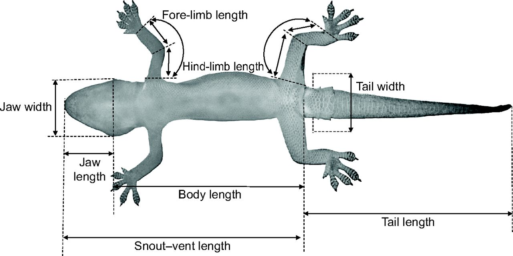
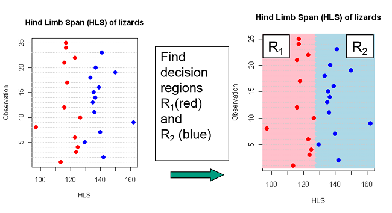
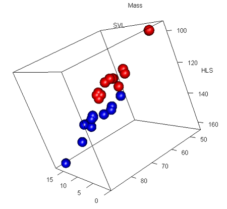

## Chapters for cluster analysis

**ISLR**

·       **Chapter 4**: Classification

o   Section 4.1: An Overview of Classification

o   Section 4.4: Generative Models for Classification

§  Section 4.4.1-4.4.2: Linear Discriminant Analysis

§  Section 4.4.3: Quadratic Discriminant Analysis

**R Book**

·       **Chapter 25**: Multivariate Statistics

o   Section 25.5: Discriminant Analysis

## "Separating and predicting"

1.  Discrimination/Classification

-   Separating objects in an existing data set
-   Find which variables that best separate the $K$ groups
-   Predict group membership for a new observation
-   Allocate new objects to known groups

## Classification problems: data setup

-   For each case $i = 1,\ldots,n$ we observe\
    response $y_i$ and predictors
    $\mathbf{x}_i = (x_{i1}, \ldots, x_{ip})$.

-   We have $n$ data cases (rows in the data set).

-   We have $p$ predictor variables.

-   **Regression**

    -   $y_i$ is quantitative. Predictors $\mathbf{x}_i$ are typically
        continuous (may include factors).

-   **Classification**

    -   $y_i$ is categorical with $K$ classes (factor with $K$ levels).
        Predictors $\mathbf{x}_i$ are usually continuous, but may be
        factors.

## Classification versus clustering

-   **Clustering**
    -   We *search for groups* in the data.
    -   No prior information about which groups and how many.
    -   Often based only on the predictors $\mathbf{x}_i$.
    -   Example: group customers by purchasing patterns.
    -   This is **unsupervised learning**.
-   **Classification**
    -   The groups (classes) are *given in advance* through the response
        $y_i$.
    -   We try to explain or predict group membership using
        $\mathbf{x}_i$.
    -   Example: predict disease status from biomarkers.
    -   This is **supervised learning**.

## Example: The iris data

-   This famous (Fisher's or Anderson's) iris data set gives the
    measurements in centimeters of the variables X1=sepal length,
    X2=sepal width, X3=petal length and X4=petal width, respectively

-   Can we classify based on X-variables?

-   What's the best method?

```{r, echo=FALSE, message=FALSE}
library(BIAS.data)
data(iris)
iris[c(5,55,125),]
```

## Pairs plot

```{r, echo=FALSE}
pairs(iris[,-5], col=iris[,"Species"], pch=20, cex=2, lower.panel = NULL)
```

## Example 2: Lizards

{width="80%"}

## Example 2: Lizards

We have in addition to sex measured $K=3$ variables on lizards:

-   Mass : Weight of lizard (in grams)
-   SVL : Snout-vent length (in millimeters)
-   HLS : Hind limb span (in millimeters)

Can we discriminate Sex on the basis of the body measures?

```{r, echo=FALSE}
data(Lizard)
head(Lizard, 5)
```

## Pairs plot - gender colored

```{r, echo=FALSE}
pairs(Lizard[,-4], col=Lizard$Sex, pch=20,cex=2)
```

## Finding decision regions

In discriminant analysis we search for decision regions for the $K$
known groups (classes).

Regions $R_1, R_2, \ldots, R_K$



## Most probable group

-   Perfect discrimination/classification may not be possible.

-   The idea is to find decision regions $R_1, R_2, \ldots, R_K$ that
    minimizes the probability of doing misclassification.

-   *Intuitively we would allocate an observation to the group which is
    most probable given the observed value of the predictors*

-   If, for example, the HLS of a new lizard is 130, it seems most
    probable based on previous data that the lizard is a male.

## Bayes theorem: Recap

For two events $A$ and $B$:

$$
P(A \mid B) = \frac{P(B \mid A)\,P(A)}{P(B)}.
$$

-   $P(A)$: probability that $A$ occurs.

-   $P(B \mid A)$: probability that $B$ occurs, given that $A$ has
    occurred.

-   $P(A \mid B)$: probability that $A$ occurs, given that $B$ has
    occurred.

-   $P(B)$: probability that $B$ occurs.

    ## Bayes theorem: Recap

    $$
    P(A \mid B) = \frac{P(B \mid A)\,P(A)}{P(B)}=\frac{P(A\cdot B)}{P(B)}.
    $$

    ```{r, echo=FALSE, fig.height=4.5}

    par(mar = c(4, 4, 2, 2))

    plot(0, 0, type = "n", xlim = c(0, 1), ylim = c(0, 1),
         xlab = "", ylab = "", axes = FALSE,
         main = "Events A, B and A ∩ B")

    # Whole sample space
    rect(0.05, 0.05, 0.95, 0.95, border = "black", lwd = 2)
    text(0.96, 0.98, "All outcomes", pos = 2, cex = 0.9)

    # Event A (left block)
    rect(0.15, 0.15, 0.55, 0.85,
         border = NA, col = rgb(0.8, 0.8, 1, 0.6))
    text(0.35, 0.87, "A", cex = 1.1)

    # Event B (vertical band)
    rect(0.45, 0.15, 0.85, 0.85,
         border = NA, col = rgb(1, 0.8, 0.8, 0.6))
    text(0.65, 0.87, "B", cex = 1.1)

    # Overlap A ∩ B
    rect(0.45, 0.15, 0.55, 0.85,
         border = NA, col = rgb(0.6, 0.6, 1, 0.8))
    text(0.50, 0.50, expression(A %*% B), cex = 1.1)

    # Annotations in terms of probabilities
    text(0.22, 0.10, "P(A) = area of A", cex = 0.8)
    text(0.70, 0.10, "P(B) = area of B", cex = 0.8)
    text(0.50, 0.18,
         "P(A ∩ B) = area of overlap",
         cex = 0.8, pos = 3)

    text(0.50, 0.02,
         "P(A | B) = P(A ∩ B) / P(B)",
         cex = 0.9)
    ```

## Bayes theorem: Formula and example

**Goal:** Find the probability that a lizard is **male** given we
observed HLS = 130.

For two classes: female $c_f$ and male $c_m$, and observed HLS $x$
$\color{blue}{P(c_m \mid x) = \frac{P(x \mid c_m)\,P(c_m)}{P(x)} =
\frac{P(x \mid c_m)\,P(c_m)}{P(x \mid c_m)\,P(c_m) + P(x \mid c_f)\,P(c_f)}}$.

-   $P(c_m)$, $P(c_f)$: **priors** (how common males/females are).
    Example: 50% males, 50% females (no prior preference)\

-   $P(x \mid c_m)$, $P(x \mid c_f)$: **probabilities** (how likely HLS
    = $x$ is in each group). E.g. how probable is HLS = 130 with each
    sex?

-   $P(c_m \mid x)$: **posterior** (probability the lizard is male given
    $x$ is HLS = 130).

## Bayes example: high HLS → male likely

-   Prior: $P(c_m) = 0.5$, $P(c_f) = 0.5$.\
-   Likelihood (probability) at $x = 130$: say\
    $P(x \mid c_m) = 0.04$, $P(x \mid c_f) = 0.01$.

Then

$$
P(c_m \mid x) = 
\frac{0.04 \cdot 0.5}{0.04 \cdot 0.5 + 0.01 \cdot 0.5}
= \frac{0.02}{0.02 + 0.005} \approx 0.80.
$$

So with HLS = 130 we would classify this lizard as **male**.\

## Low HLS → female likely

Consider again a low HLS value $x = 110$.

-   Prior probabilities (**now** males more common):
    -   $P(c_m) = 0.7$
    -   $P(c_f) = 0.3$
-   Likelihood (probability) at $x = 110$ (value fits females better):
    -   $P(x \mid c_m) = 0.01$
    -   $P(x \mid c_f) = 0.05$
-   $$
    P(c_f \mid x) 
    =
    \frac{0.05 \cdot 0.3}{0.05 \cdot 0.3 + 0.01 \cdot 0.7}
    = \frac{0.015}{0.015 + 0.007} \approx 0.68.
    $$

Even though males are more common overall, for HLS = 110 the lizard is
still more likely to be **female**.

## Many classes

Using Bayes theorem we find the probability that the object belongs to
class $c_i$ given one observed value $x$:

$$
P(c_i \mid x) =
\frac{P(x \mid c_i)\,P(c_i)}
     {\sum_{j=1}^K P(x \mid c_j)\,P(c_j)}.
$$

-   The denominator is constant
    $const= \sum_{j=1}^K P(x \mid c_j) P(c_j)$ ensures that the class
    probabilities $P(c_i \mid x)$ add up to 1.

In compact notation with $P(c_i \mid x) \propto P(c_i)\,P(x \mid c_i),$

and for continuous $x$ we have the likelihood $f$ function
$P(c_i \mid x) \propto P(c_i)\,f(x \mid c_i),$

which we often summarize as
$\color{red}{\text{Posterior}} \propto \color{blue}{\text{Prior}} \times \color{green}{\text{Likelihood}}.$

## Linear Discriminant Analysis (LDA)

**Starting simple: One covariate**

In LDA we **assume** that the predictor(s) follow a *normal
distribution* within each class.

For the lizard example with one variable ($x_1$ = HLS):

-   For class 1 (females): $x|c_1 \sim N(\mu_1, \sigma^2)$
-   For class 2 (males): $x|c_2 \sim N(\mu_2, \sigma^2)$

**Key assumption**: *Common variance* $\sigma^2$ for both classes, but
possibly different means

We estimate $\mu_1$, $\mu_2$ and $\sigma^2$ from the training data.

## LDA: Classification rule (one covariate)

Assume prior probabilities for females and males, e.g.:
$p_1 = p_2 = 0.5$

Assume $x_1$ = HLS is the only predictor.

From the data we estimate $\mu_1$, $\mu_2$ and common $\sigma^2$ for
both classes. Let $f_1 = N(\widehat{\mu}_1, \widehat{\sigma}^2)$ and
$f_2= N(\widehat{\mu}_2, \widehat{\sigma}^2)$.

**Classification rule**: Classify a new lizard as *female* if it is more
likely a posteriori

$$\color{blue}{\frac{p(c_f|x^*)}{p(c_m|x^*)} =\frac{f_1(x^*)\cdot p_1}{p(x^*)}\cdot\frac{p(x^*)}{f_2(x^*)\cdot p_2}= \frac{f_1(x^*)\cdot p_1}{f_2(x^*)\cdot p_2}\geq 1}$$

or, alternatively in other words if

$$\color{red}{f_1(x^*)\cdot p_1 \geq f_2(x^*)\cdot p_2}$$

## Why is LDA "Linear"? (One covariate)

The decision boundary is when $f_1(x) \cdot p_1 = f_2(x) \cdot p_2$

With equal priors of 0.5 and common variance $\sigma^2$:
$$0.5 \frac{1}{\sqrt{2\pi\sigma^2}}e^{-\frac{(x-\mu_1)^2}{2\sigma^2}} = 0.5\frac{1}{\sqrt{2\pi\sigma^2}}e^{-\frac{(x-\mu_2)^2}{2\sigma^2}}$$

Taking logarithms and simplifying:
$$-(x-\mu_1)^2/2\sigma^2 = -(x-\mu_2)^2/2\sigma^2$$
$$x^2 - 2x\mu_1 + \mu_1^2 = x^2 - 2x\mu_2 + \mu_2^2$$
$$2x(\mu_2 - \mu_1) = \mu_2^2 - \mu_1^2 \text{ is linear, hence }\color{red}{x = \frac{\mu_1 + \mu_2}{2}}$$

A single **separating point** (in 1D), extends to a **line** in 2D,
**etc.**

## Visualizing LDA with uniform priors

```{r, echo=FALSE, message=FALSE, fig.height=4.5, warning=FALSE}
library(MASS)
library(mixlm)
data(Lizard)

# Fit LDA with uniform prior
fit_uniform <- lda(Sex ~ HLS, data = Lizard, prior = c(0.5, 0.5))

# Extract means and pooled SD
mu_m <- fit_uniform$means["m", "HLS"]      # male
mu_f <- fit_uniform$means["f", "HLS"]      # female


# Calculate pooled variance
n_f   <- sum(Lizard$Sex == "f")
n_m   <- sum(Lizard$Sex == "m")
var_f <- var(Lizard$HLS[Lizard$Sex == "f"])
var_m <- var(Lizard$HLS[Lizard$Sex == "m"])
pooled_sd <- sqrt(((n_f - 1) * var_f + (n_m - 1) * var_m) / (n_f + n_m - 2))

# Create x values based on data range
hls_min <- min(Lizard$HLS, na.rm = TRUE)
hls_max <- max(Lizard$HLS, na.rm = TRUE)
x_vals  <- seq(hls_min - 5, hls_max + 5, length.out = 300)

# Calculate densities with priors
dens_f <- dnorm(x_vals, mean = mu_f, sd = pooled_sd) * 0.5
dens_m <- dnorm(x_vals, mean = mu_m, sd = pooled_sd) * 0.5

# Decision boundary (where f1 * p1 = f2 * p2)
decision_boundary <- (mu_f + mu_m) / 2

# Compute y-limits safely
y_all <- c(dens_f, dens_m)
y_all <- y_all[is.finite(y_all)]
y_max <- ifelse(length(y_all) > 0, max(y_all), 1)

# Plot
plot(x_vals, dens_f, type = "l", col = "red", lwd = 2,
     ylim = c(0, y_max * 1.1),
     xlab = "HLS (Hind Limb Span)", ylab = "Density × Prior",
     main = "LDA with Uniform Priors (p1 = p2 = 0.5)")
lines(x_vals, dens_m, col = "blue", lwd = 2)
abline(v = decision_boundary, lty = 2, lwd = 2, col = "darkgreen")

## Add observed HLS values
# Small offset near zero for visibility
y_base <- y_max * 0.02
points(Lizard$HLS[Lizard$Sex == "f"], 
       rep(y_base, sum(Lizard$Sex == "f")),
       pch = 3, col = "red", cex = 0.7)
points(Lizard$HLS[Lizard$Sex == "m"], 
       rep(y_base, sum(Lizard$Sex == "m")),
       pch = 3, col = "blue", cex = 0.7)

legend("topright",
       legend = c("Female × 0.5", "Male × 0.5", "Decision boundary",
                  "Observed HLS (f)", "Observed HLS (m)"),
       col    = c("red", "blue", "darkgreen", "red", "blue"),
       lwd    = c(2, 2, 2, NA, NA),
       pch    = c(NA, NA, NA, 3, 3),
       lty    = c(1, 1, 2, NA, NA),
       cex    = 0.8)
text(decision_boundary + 0.5, y_max * 0.9,
     sprintf("x = %.1f", decision_boundary),
     pos = 4, col = "darkgreen")

```

## LDA with non-uniform priors

If we assume males are more abundant: $p_1 = 0.2$ (female) and $p_2=0.8$
(male)

```{r, echo=FALSE, fig.height=4.5, warning=FALSE}
# Fit LDA with non-uniform prior
library(MASS)
library(mixlm)
data(Lizard)

# Fit LDA with uniform prior (already done earlier, reused here)
fit_uniform <- lda(Sex ~ HLS, data = Lizard, prior = c(0.5, 0.5))

# Extract class means consistently with levels: m, f
mu_m <- fit_uniform$means["m", "HLS"]  # male
mu_f <- fit_uniform$means["f", "HLS"]  # female

# Pooled SD (reused from earlier chunk if already computed)
n_f   <- sum(Lizard$Sex == "f")
n_m   <- sum(Lizard$Sex == "m")
var_f <- var(Lizard$HLS[Lizard$Sex == "f"])
var_m <- var(Lizard$HLS[Lizard$Sex == "m"])
pooled_sd <- sqrt(((n_f - 1) * var_f + (n_m - 1) * var_m) / (n_f + n_m - 2))

# x grid based on data range (reuse if already defined)
hls_min <- min(Lizard$HLS, na.rm = TRUE)
hls_max <- max(Lizard$HLS, na.rm = TRUE)
x_vals  <- seq(hls_min - 5, hls_max + 5, length.out = 300)

# Fit LDA with non-uniform prior: levels are c("m","f") → c(p_m, p_f)
fit_nonuniform <- lda(Sex ~ HLS, data = Lizard, prior = c(0.8, 0.2))

# Densities with non-uniform priors: p_f = 0.2, p_m = 0.8
dens_f_nu <- dnorm(x_vals, mean = mu_f, sd = pooled_sd) * 0.2
dens_m_nu <- dnorm(x_vals, mean = mu_m, sd = pooled_sd) * 0.8

# New decision boundary:
# x = (mu_f + mu_m)/2 + (sigma^2 / (mu_m - mu_f)) * log(p_m / p_f)
decision_boundary_nu <- (mu_f + mu_m) / 2 -
  (pooled_sd^2 / (mu_m - mu_f)) * log(0.8 / 0.2)

# Compute y-limits safely
y_all_nu <- c(dens_f_nu, dens_m_nu)
y_all_nu <- y_all_nu[is.finite(y_all_nu)]
y_max_nu <- ifelse(length(y_all_nu) > 0, max(y_all_nu), 1)

# Plot
plot(x_vals, dens_f_nu, type = "l", col = "red", lwd = 2, 
     ylim = c(0, y_max_nu * 1.1),
     xlab = "HLS (Hind Limb Span)", ylab = "Density × Prior", 
     main = "LDA with Non-uniform Priors (p_f = 0.2, p_m = 0.8)")
lines(x_vals, dens_m_nu, col = "blue", lwd = 2)
abline(v = decision_boundary_nu, lty = 2, lwd = 2, col = "darkgreen")

# Add observed HLS values
y_base_nu <- y_max_nu * 0.02
points(Lizard$HLS[Lizard$Sex == "f"],
       rep(y_base_nu, sum(Lizard$Sex == "f")),
       pch = 3, col = "red", cex = 0.7)
points(Lizard$HLS[Lizard$Sex == "m"],
       rep(y_base_nu, sum(Lizard$Sex == "m")),
       pch = 3, col = "blue", cex = 0.7)

legend("topright",
       legend = c("Female × 0.2", "Male × 0.8", "Decision boundary",
                  "Observed HLS (f)", "Observed HLS (m)"),
       col    = c("red", "blue", "darkgreen", "red", "blue"),
       lwd    = c(2, 2, 2, NA, NA),
       pch    = c(NA, NA, NA, 3, 3),
       lty    = c(1, 1, 2, NA, NA),
       cex    = 0.8)

text(decision_boundary_nu - 0.5, y_max_nu * 0.9, 
     sprintf("x = %.1f", decision_boundary_nu),
     pos = 2, col = "darkgreen")

```

## Decision boundary with lizard data (uniform prior)

```{r, echo=FALSE, fig.height=4.5}
# Create jittered plot with decision boundary, y = observation id
set.seed(123)
id <- 1:nrow(Lizard)

plot(Lizard$HLS,
     jitter(id, amount = 0.1),
     col = ifelse(Lizard$Sex == "f", "red", "blue"),
     pch = 19, cex = 1.5,
     xlab = "HLS (Hind Limb Span)",
     ylab = "Observation ID",
     main = "LDA Decision Boundary (Uniform Prior)")

abline(v = decision_boundary, lwd = 3, col = "darkgreen", lty = 2)

text(decision_boundary - 18, max(id) * 0.95,
     "Classify as\nFemale", col = "red", font = 2)
text(decision_boundary + 18, max(id) * 0.95,
     "Classify as\nMale", col = "blue", font = 2)

```

## Decision boundary with lizard data (non-uniform prior)

```{r, echo=FALSE, fig.height=4.5}
# Create jittered plot with decision boundary for non-uniform prior
set.seed(123)
id <- 1:nrow(Lizard)

plot(Lizard$HLS,
     jitter(id, amount = 0.1),
     col = ifelse(Lizard$Sex == "f", "red", "blue"),
     pch = 19, cex = 1.5,
     xlab = "HLS (Hind Limb Span)",
     ylab = "Observation ID",
     main = "LDA Decision Boundary (Non-uniform Prior)")

abline(v = decision_boundary_nu, lwd = 3, col = "darkgreen", lty = 2)

text(decision_boundary_nu - 18, max(id) * 0.95,
     "Classify as\nFemale", col = "red", font = 2)
text(decision_boundary_nu + 28, max(id) * 0.95,
     "Classify as\nMale", col = "blue", font = 2)

# Note the shift
text(min(Lizard$HLS) + 9, max(id) * 0.1,
     "Boundary shifts LEFT\n(favoring male classification)",
     col = "darkgreen", font = 3, cex = 0.9)

```

## LDA in RStudio

predict gives classes and $P(c_i|x_1^*)$ - *posterior* probability.

Remember $P(c_i|x_1^*) \propto f_i(x_1^*)\cdot p_i$ for $i=1,2$ here:

```{r, echo=TRUE, eval=TRUE, message=FALSE}
DAModel.1 <- MASS::lda(Sex~HLS, data=Lizard, prior=rep(0.5,2))
preds <- predict(DAModel.1,data=Lizard)
preds$class[1:18]
preds$posterior[1:3,]
```

## Confusion matrix (uniform prior)

The fit is presented as a *confusion matrix* and *accuracy* of
classification

```{r, echo=TRUE, message=FALSE}
confusion(Lizard$Sex, preds$class) # confusion matrix
```

## LDA in R with non-uniform priors

```{r, echo=TRUE}
DAModel.2 <- lda(Sex~HLS, data=Lizard, prior=c(0.8, 0.2))
confusion(Lizard$Sex, predict(DAModel.2)$class) # confusion matrix
```

Notice how the classification changes when we favor males!

## The default choice prior

In RStudio the default choice of prior is "empirical" which means that
the priors are set equal to the group proportions in the data set

Hence, if there are $n_i$ observations in group $i$ and
$N = \sum_{i=1}^K n_i$ is the total observation number, then

$$\widehat{p}_i = \frac{n_i}{N}$$

This may be reasonable if one assumes that the sample sizes reflect
population sizes.

## LDA in R with the default priors

```{r, echo=TRUE}
DAModel.2 <- lda(Sex~HLS, data=Lizard)
DAModel.2$prior
```

```{r, echo=FALSE}
confusion(Lizard$Sex, predict(DAModel.2)$class) # confusion matrix
```

## Extending LDA to multiple covariates

Once we understand LDA with one covariate, the extension to multiple
covariates is straightforward:

-   Instead of univariate normal distributions, we use *multivariate
    normal* distributions
-   The variance $\sigma^2$ becomes a covariance matrix $\Sigma$ (still
    common across classes)
-   The decision boundary becomes a line, plane or hyperplane (linear in
    the predictor space)

**Next**: Let's recall the bivariate normal distribution first

## The Bivariate Normal Distribution

For two random variables $(X_1, X_2)$, the bivariate normal distribution
is characterized by:

-   **Means**: $\mu_1$ and $\mu_2$
-   **Variances**: $\sigma_1^2$ and $\sigma_2^2$
-   **Correlation**: $\rho$ (or covariance $\sigma_{12}$), where
    $\rho = \frac{\sigma_{12}}{\sigma_1\cdot\sigma_2}$

The **covariance matrix** combines all this information:

$$\Sigma = \begin{pmatrix} \sigma_1^2 & \sigma_{12} \\ \sigma_{12} & \sigma_2^2 \end{pmatrix}$$

The density forms an elliptical "hill" in 3D space.

## Visualizing Bivariate Normal

```{r, echo=FALSE, message=FALSE, fig.height=4.5}
library(mvtnorm)

# Parameters for bivariate normal
mu <- c(120, 80)
Sigma <- matrix(c(100, 0, 0, 20), ncol=2)

# Create grid
x1 <- seq(100, 140, length.out = 50)
x2 <- seq(60, 100, length.out = 50)
grid <- expand.grid(x1=x1, x2=x2)

# Calculate densities
grid$density <- dmvnorm(grid, mean=mu, sigma=Sigma)

# 3D perspective plot
z <- matrix(grid$density, nrow=50, ncol=50)
persp(x1, x2, z, theta=30, phi=25, 
      xlab="HLS", ylab="Mass", zlab="Density",
      main="Bivariate Normal Distribution",
      col="lightblue", shade=0.5, ticktype="detailed")
```

## Bivariate Normal: Contour View (no correlation)

```{r, echo=FALSE, message=FALSE, fig.height=4.5}
# Contour plot

contour(x1, x2, z, nlevels=10,
        xlab="HLS (Hind Limb Span)", ylab="Mass",
        main="Contour Plot of Bivariate Normal",
        col="blue", lwd=2)

# Add mean point
points(mu[1], mu[2], pch=19, col="red", cex=2)
text(mu[1]+2, mu[2]+2, expression(paste("(", mu[1], ", ", mu[2], ")")), 
     col="red", pos=4, cex=1.2)
```

## Bivariate Normal: Contour View (positive correlation)

```{r, echo=FALSE, message=FALSE, fig.height=4.5}
library(mvtnorm)

# Parameters for bivariate normal with positive correlation
mu <- c(120, 80)
Sigma <- matrix(c(100, 60,
                  60, 40), ncol = 2)
# Var(HLS)=100, Var(Mass)=40, Cov=60 > 0 → positive correlation

# Create grid
x1 <- seq(100, 140, length.out = 50)
x2 <- seq(60, 100, length.out = 50)
grid <- expand.grid(x1 = x1, x2 = x2)

# Calculate densities
grid$density <- dmvnorm(grid, mean = mu, sigma = Sigma)
z <- matrix(grid$density, nrow = 50, ncol = 50)

# Contour plot
contour(x1, x2, z, nlevels = 10,
        xlab = "HLS (Hind Limb Span)", ylab = "Mass",
        main = "Bivariate normal with positive correlation",
        col = "blue", lwd = 2)
points(mu[1], mu[2], pch=19, col="red", cex=2)
```

## LDA with Two Covariates: The Setup

For lizard example with HLS and Mass ($p=2$):

**Female class** ($c_1$):
$$\mathbf{X}|c_1 \sim N_2(\boldsymbol{\mu}_1, \boldsymbol{\Sigma})$$

**Male class** ($c_2$):
$$\mathbf{X}|c_2 \sim N_2(\boldsymbol{\mu}_2, \boldsymbol{\Sigma})$$

**Assume**: *Same covariance* matrix $\boldsymbol{\Sigma}$ for both
classes

The classification rule becomes:
$$\text{Classify as female if: } f_1(\mathbf{x}^*) \cdot p_1 \geq f_2(\mathbf{x}^*) \cdot p_2$$

where $f_i$ is the bivariate normal density for class $i$.

## LDA with two predictors in R

```{r, echo=TRUE, message=FALSE}
# LDA with two predictors: HLS and Mass
lda_2var <- lda(Sex ~ HLS + Mass,data  = Lizard, prior = c(0.5, 0.5))
pred_2var <- predict(lda_2var)$class
confusion(Lizard$Sex, pred_2var)
```

## Visualizing Bivariate LDA for Lizards

```{r, echo=FALSE, message=FALSE, fig.height=4.5}
library(MASS)
library(mvtnorm)
data(Lizard)

# Fit bivariate LDA (levels: m, f)
lda_biv <- lda(Sex ~ HLS + Mass, data = Lizard, prior = c(0.5, 0.5))

# Extract class means ONLY for HLS and Mass
mu_m_biv <- lda_biv$means["m", c("HLS", "Mass")]  # male
mu_f_biv <- lda_biv$means["f", c("HLS", "Mass")]  # female

# Calculate pooled covariance on HLS and Mass
X_f <- as.matrix(Lizard[Lizard$Sex == "f", c("HLS", "Mass")])
X_m <- as.matrix(Lizard[Lizard$Sex == "m", c("HLS", "Mass")])
n_f_biv <- nrow(X_f)
n_m_biv <- nrow(X_m)
S_f <- cov(X_f)
S_m <- cov(X_m)
S_pooled <- ((n_f_biv - 1) * S_f + (n_m_biv - 1) * S_m) / (n_f_biv + n_m_biv - 2)

# Create grid for decision boundary
hls_seq  <- seq(min(Lizard$HLS)  - 5, max(Lizard$HLS)  + 5, length.out = 100)
mass_seq <- seq(min(Lizard$Mass) - 5, max(Lizard$Mass) + 5, length.out = 100)
grid_biv <- expand.grid(HLS = hls_seq, Mass = mass_seq)

# Matrix with only the two predictor columns for dmvnorm
X_grid <- as.matrix(grid_biv[, c("HLS", "Mass")])

# Calculate class scores on the grid (up to a constant)
grid_biv$score_f <- dmvnorm(X_grid, mean = mu_f_biv, sigma = S_pooled) * 0.5
grid_biv$score_m <- dmvnorm(X_grid, mean = mu_m_biv, sigma = S_pooled) * 0.5

# Plot observed data
plot(Lizard$HLS, Lizard$Mass,
     col = ifelse(Lizard$Sex == "f", "red", "blue"),
     pch = 19, cex = 1.5,
     xlab = "HLS (Hind Limb Span)", ylab = "Mass",
     main = "Bivariate LDA: Decision Boundary (Uniform Prior)")

# Add decision boundary: contour where score_f = score_m
z_diff <- matrix(grid_biv$score_f - grid_biv$score_m,
                 nrow = length(hls_seq), ncol = length(mass_seq))
contour(hls_seq, mass_seq, z_diff, levels = 0,
        add = TRUE, col = "darkgreen", lwd = 3, labels = "")

# Add class means
points(mu_f_biv["HLS"], mu_f_biv["Mass"], pch = 4, col = "black",  cex = 3, lwd = 3)
points(mu_m_biv["HLS"], mu_m_biv["Mass"], pch = 4, col = "black", cex = 3, lwd = 3)

legend("topleft",
       legend = c("Female", "Male", "Decision boundary", "Class means"),
       col    = c("red", "blue", "darkgreen", "black"),
       pch    = c(19, 19, NA, 4),
       lty    = c(NA, NA, 1, NA),
       lwd    = c(NA, NA, 3, 3),
       cex    = 0.8)
```

## Tri-variate discrimination

Using all variables ($K=3$)

A linear discriminator is a flat plane in the 3D-space



## LDA with three predictors

```{r, echo = TRUE}
lda_3var <- lda(Sex ~ HLS + Mass + SVL,data  = Lizard, prior = c(0.5, 0.5))
pred_3var <- predict(lda_3var)$class
confusion(Lizard$Sex, pred_3var)
```

## From LDA to QDA: Relaxing the assumption

**LDA assumption**: All classes share the same variance $\sigma^2$ or
covariance matrix $\boldsymbol{\Sigma}$

**QDA relaxation**: Each class $i$ has its own variance $\sigma_i^2$ or
covariance matrix $\boldsymbol{\Sigma}_i$

**Consequences**: - More flexible (can capture different variability
patterns) - Decision boundaries become **quadratic** (curved surfaces) -
More parameters to estimate (may overfit with small data)

**When to use QDA**: When classes clearly have different
spreads/correlations. Or when we see a clearly non-linear decision
boundary

## Why is QDA "Quadratic"? 

**Key difference**: Each class has its own variance $\sigma_1^2$ and
$\sigma_2^2$ and $p_1$ = $p_2$

Decision boundary where $f_1(x) \cdot p_1 = f_2(x) \cdot p_2$:

$\frac{0.5}{\sqrt{2\pi\sigma_1^2}}e^{-\frac{(x-\mu_1)^2}{2\sigma_1^2}} = \frac{0.5}{\sqrt{2\pi\sigma_2^2}}e^{-\frac{(x-\mu_2)^2}{2\sigma_2^2}}$taking
logarithms:
$-\frac{1}{2}\log(\sigma_1^2) - \frac{(x-\mu_1)^2}{2\sigma_1^2} = - \frac{1}{2}\log(\sigma_2^2) - \frac{(x-\mu_2)^2}{2\sigma_2^2}$

**Quadratic equation in** $x$ since $x^2$ is no longer removed

$ax^2 + bx + c = 0$

**Result**: porabolic **boundaries** in higher dimensions

## Running QDA with Different covariances (2D)

```{r, echo=TRUE, message=FALSE, fig.height=4.5, warning=FALSE}
# Fit QDA with two predictors (HLS and Mass)
qda_biv <- qda(Sex ~ HLS + Mass, data = Lizard, prior = c(0.5, 0.5))
qda_biv <- predict(qda_biv)$class
confusion(Lizard$Sex, qda_biv)

```

## QDA: Visualizing Different Covariances

```{r, echo=FALSE, message=FALSE, fig.height=4.5}
library(MASS)
library(mvtnorm)
library(ellipse)
data(Lizard)

# Fit LDA first to reuse means (or use qda means; both fine for visual)
lda_biv <- qda(Sex ~ HLS + Mass, data = Lizard, prior = c(0.5, 0.5))

# Class means ONLY for HLS and Mass; levels: "m","f"
mu_m_biv <- lda_biv$means["m", c("HLS", "Mass")]
mu_f_biv <- lda_biv$means["f", c("HLS", "Mass")]

# Class-specific covariances (HLS, Mass)
X_f <- as.matrix(Lizard[Lizard$Sex == "f", c("HLS", "Mass")])
X_m <- as.matrix(Lizard[Lizard$Sex == "m", c("HLS", "Mass")])
S_f_qda <- cov(X_f)
S_m_qda <- cov(X_m)

# Grid for QDA decision boundary (same size as LDA plot)
hls_seq  <- seq(min(Lizard$HLS)  - 5, max(Lizard$HLS)  + 5, length.out = 100)
mass_seq <- seq(min(Lizard$Mass) - 5, max(Lizard$Mass) + 5, length.out = 100)
grid_qda <- expand.grid(HLS = hls_seq, Mass = mass_seq)
X_grid   <- as.matrix(grid_qda[, c("HLS", "Mass")])

# QDA scores (equal priors 0.5, 0.5)
score_f_qda <- dmvnorm(X_grid, mean = mu_f_biv, sigma = S_f_qda) * 0.5
score_m_qda <- dmvnorm(X_grid, mean = mu_m_biv, sigma = S_m_qda) * 0.5

# Difference matrix for contouring
z_diff_qda <- matrix(score_f_qda - score_m_qda,
                     nrow = length(hls_seq),
                     ncol = length(mass_seq))

# Plot data
plot(Lizard$HLS, Lizard$Mass,
     col = ifelse(Lizard$Sex == "f", "red", "blue"),
     pch = 19, cex = 1.5,
     xlim = c(77,170),
     ylim = c(-10,20),
     xlab = "HLS (Hind Limb Span)", ylab = "Mass",
     main = "QDA: Curved Decision Boundary (Class-Specific Covariances)")

# Add QDA decision boundary
contour(hls_seq, mass_seq, z_diff_qda, levels = 0,
        add = TRUE, col = "darkgreen", lwd = 3, drawlabels = FALSE)

# Add covariance ellipses (95% confidence)
lines(ellipse(S_f_qda, centre = mu_f_biv, level = 0.95),
      col = "red", lwd = 2, lty = 2)
lines(ellipse(S_m_qda, centre = mu_m_biv, level = 0.95),
      col = "blue", lwd = 2, lty = 2)

# Add means
points(mu_f_biv["HLS"], mu_f_biv["Mass"], pch = 4, col = "red",  cex = 3, lwd = 3)
points(mu_m_biv["HLS"], mu_m_biv["Mass"], pch = 4, col = "blue", cex = 3, lwd = 3)

legend("topleft",
       legend = c("Female", "Male", "QDA boundary", "95% ellipses"),
       col    = c("red", "blue", "darkgreen", "black"),
       pch    = c(19, 19, NA, NA),
       lty    = c(NA, NA, 1, 2),
       lwd    = c(NA, NA, 3, 2),
       cex    = 0.8)
```

## LDA vs QDA: Key Differences Summary

|   | **LDA** | **QDA** |
|------------------------|------------------------|------------------------|
| **Covariance** | Common $\boldsymbol{\Sigma}$ | Class-specific $\boldsymbol{\Sigma}_i$ |
| **Decision boundary** | Linear (hyperplane) | Quadratic (curved) |
| **Parameters** | Fewer | More |
| **Flexibility** | Less flexible | More flexible |
| **Risk** | Underfitting | Overfitting (small data) |
| **Best for** | Similar class spreads | Different class spreads |

## Model selection/evaluation

-   We often want to compare the performance of different classifiers

-   Many available statistics for this purpose, but we will consider the
    accuracy or the apparent error rate (APER)

-   The performance of a classifier may, as we've seen be summarized in
    a *confusion matrix*

## Example - SVL as predictor

We shall use snout-vent length (in millimeters)

```{r, echo=TRUE}
DAModel.4 <- qda(Sex~SVL, data=Lizard, prior=rep(0.5,2))
confusion(Lizard$Sex, predict(DAModel.4)$class) # confusion matrix
```

## Metrics to check

|             | True Male | True Female |
|-------------|-----------|-------------|
| Pred Male   | 10        | 2           |
| Pred Female | 3         | 10          |

-   $P(\text{classify as female} | \text{true male}) = 3/13 \approx 0.23$
    (**FNR** for males)
-   $P(\text{classify as male} | \text{true female}) = 2/12 \approx 0.17$
    (**FPR** for males)
-   Apparent error rate (APER) = $\frac{3 + 2}{25} = 0.2$
-   Accuracy = $1 - \text{APER} = \frac{10+12}{25} = 0.8$

## Validation of the model

-   We need **new test data** to get an honest classification error.

-   Alternatively perform **cross-validation**:

    -   **Leave-one-out Cross-Validation (LOOCV)**: available in R,
        choose the option `CV = TRUE`.
    -   **K-fold Cross-Validation**: split the data into $K$ folds, fit
        the model on $K-1$ folds and test on the remaining fold, repeat
        $K$ times and average the error.

-   Another option is the **bootstrap**:

    -   Draw many bootstrap samples from the training data, refit the
        classifier on each sample, and evaluate predictions on the
        observations left out (or on the original data) to estimate
        variability and bias of the error rate.

## LOOCV: Leave One Out Cross Validation:

1.  for $i$ = 1, ..., n
2.  Leave out observation $i$ from complete data and fit model.
3.  Classify observation i

For each observation we can check if it is was correctly classified.
Cross Validation (CV) is a good alternative for model evaluation when we
don't have fresh test data.

We can use CV to find the best model from a set or just to evaluate a
given model.

## Example - Cross Validation (CV = TRUE)

`res$class` contains these cross‑validated predicted classes for all
observations

```{r, echo=TRUE}
res <- lda(Sex ~ SVL, data = Lizard,
prior = c(0.5, 0.5), CV = TRUE)
res$class
```

## Confusion matrix for CV

```{r, echo=TRUE}
res <- qda(Sex ~ SVL, data=Lizard,
prior = c(0.5, 0.5), CV = TRUE)
confusion(Lizard$Sex, res$class)
```

Typically, accuracy goes down, and the errors increase.

## Iris (3 classes): LDA with two predictors

```{r, echo=TRUE, message=FALSE}
iris_lda <- lda(Species ~ Petal.Length + Petal.Width, data  = iris)
iris_cv <- lda(Species ~ Petal.Length + Petal.Width, data  = iris, CV    = TRUE)
confusion(iris$Species, iris_cv$class)

```

## Iris (3 classes): LDA decision regions

```{r, echo=FALSE, message=FALSE, fig.height=4.5, warning=FALSE}
library(MASS)
data(iris)

iris_lda <- lda(Species ~ Petal.Length + Petal.Width,
                data  = iris,
                prior = rep(1/3, 3))

pl_seq <- seq(min(iris$Petal.Length) - 0.5,
              max(iris$Petal.Length) + 0.5, length.out = 200)
pw_seq <- seq(min(iris$Petal.Width)  - 0.5,
              max(iris$Petal.Width)  + 0.5, length.out = 200)

grid_iris <- expand.grid(Petal.Length = pl_seq,
                         Petal.Width  = pw_seq)

grid_pred_lda <- predict(iris_lda, newdata = grid_iris)$class

cols_bg <- c(setosa = "lightgreen",
             versicolor = "lightblue",
             virginica = "moccasin")
cols_pt <- c(setosa = "darkgreen",
             versicolor = "darkblue",
             virginica  = "darkorange")

grid_col_lda <- cols_bg[as.character(grid_pred_lda)]

plot(grid_iris$Petal.Length, grid_iris$Petal.Width,
     col = grid_col_lda, pch = 15, cex = 0.5,
     xlab = "Petal length", ylab = "Petal width",
     main = "Iris (3 classes): LDA decision regions")

points(iris$Petal.Length, iris$Petal.Width,
       col = cols_pt[iris$Species],
       pch = 19, cex = 1.2)

legend("topleft",
       legend = c("setosa", "versicolor", "virginica"),
       col    = c("darkgreen", "darkblue", "darkorange"),
       pch    = 19, cex = 0.9, bg = "white")
```

## Iris (3 classes): QDA with two predictors

```{r, echo=TRUE, message=FALSE}
iris_qda <- qda(Species ~ Petal.Length + Petal.Width, data  = iris)
iris_qda_cv <- qda(Species ~ Petal.Length + Petal.Width, data  = iris, 
                   CV = TRUE)
confusion(iris$Species, iris_qda_cv$class)
```

## Iris (3 classes): LDA vs QDA decision regions

```{r, echo=FALSE, message=FALSE, fig.height=4.5, warning=FALSE}
library(MASS)
data(iris)

iris_lda <- lda(Species ~ Petal.Length + Petal.Width,
                data  = iris,
                prior = rep(1/3, 3))
iris_qda <- qda(Species ~ Petal.Length + Petal.Width,
                data  = iris,
                prior = rep(1/3, 3))

pl_seq <- seq(min(iris$Petal.Length) - 0.5,
              max(iris$Petal.Length) + 0.5, length.out = 200)
pw_seq <- seq(min(iris$Petal.Width)  - 0.5,
              max(iris$Petal.Width)  + 0.5, length.out = 200)

grid_iris <- expand.grid(Petal.Length = pl_seq,
                         Petal.Width  = pw_seq)

cols_bg <- c(setosa = "lightgreen",
             versicolor = "lightblue",
             virginica = "moccasin")
cols_pt <- c(setosa = "darkgreen",
             versicolor = "darkblue",
             virginica  = "darkorange")

par(mfrow = c(1, 2))

# LDA regions
grid_pred_lda <- predict(iris_lda, newdata = grid_iris)$class
grid_col_lda  <- cols_bg[as.character(grid_pred_lda)]

plot(grid_iris$Petal.Length, grid_iris$Petal.Width,
     col = grid_col_lda, pch = 15, cex = 0.5,
     xlab = "Petal length", ylab = "Petal width",
     main = "Iris: LDA decision regions")

points(iris$Petal.Length, iris$Petal.Width,
       col = cols_pt[iris$Species],
       pch = 19, cex = 1.1)

legend("topleft",
       legend = c("setosa", "versicolor", "virginica"),
       col    = c("darkgreen", "darkblue", "darkorange"),
       pch    = 19, cex = 0.8, bg = "white")

# QDA regions
grid_pred_qda <- predict(iris_qda, newdata = grid_iris)$class
grid_col_qda  <- cols_bg[as.character(grid_pred_qda)]

plot(grid_iris$Petal.Length, grid_iris$Petal.Width,
     col = grid_col_qda, pch = 15, cex = 0.5,
     xlab = "Petal length", ylab = "Petal width",
     main = "Iris: QDA decision regions")

points(iris$Petal.Length, iris$Petal.Width,
       col = cols_pt[iris$Species],
       pch = 19, cex = 1.1)

legend("topleft",
       legend = c("setosa", "versicolor", "virginica"),
       col    = c("darkgreen", "darkblue", "darkorange"),
       pch    = 19, cex = 0.8, bg = "white")

par(mfrow = c(1, 1))
```

## k-nearest neighbours (KNN)

-   Non-parametric classifier: no assumptions like normality or equal
    covariances.
-   For a new **x**, find the **k** closest training points, then
    classify by majority vote.
-   Small **k** → very flexible, can overfit noise.
-   Large **k** → smoother decision boundary, higher bias, lower
    variance.
-   Choice of k should be based on **validation**, not training
    accuracy.

## Visual intuition for KNN (k = 3)

```{r, echo=FALSE, message=FALSE, fig.height=4}
set.seed(123)

# Simple 2D toy example with two classes
n_per_class <- 20
x1_class1 <- cbind(rnorm(n_per_class, -1, 0.4),
                   rnorm(n_per_class, -1, 0.4))
x1_class2 <- cbind(rnorm(n_per_class,  1, 0.4),
                   rnorm(n_per_class,  1, 0.4))

X <- rbind(x1_class1, x1_class2)
Y <- factor(c(rep("Class 1", n_per_class),
              rep("Class 2", n_per_class)))

cols <- c("Class 1" = "steelblue",
          "Class 2" = "darkorange")

# New points to classify
X_new <- rbind(c(-0.2, -0.1),
               c( 0.4,  0.2),
               c( 0.0,  0.9))
rownames(X_new) <- c("A", "B", "C")

k <- 3

plot(X, col = cols[Y], pch = 19, cex = 1.2,
     xlab = "X1", ylab = "X2",
     main = paste0("KNN idea: classify A, B, C with k = ", k))

# For each new point, find k nearest neighbours and show majority class
for (i in 1:nrow(X_new)) {
  x_new <- X_new[i, ]
  D <- sqrt(rowSums(
    (X - matrix(x_new, nrow = nrow(X), ncol = 2, byrow = TRUE))^2
  ))
  nn_index <- order(D)[1:k]
  maj_class <- names(sort(table(Y[nn_index]), decreasing = TRUE))[1]
  # new point
  points(x_new[1], x_new[2], pch = 4, col = "black", lwd = 2, cex = 2)
  text(x_new[1], x_new[2],
       labels = paste0(" ", rownames(X_new)[i]),
       pos = 4, cex = 0.9)
  # highlight its neighbours
  points(X[nn_index, , drop = FALSE],
         pch = 21, bg = cols[Y[nn_index]],
         cex = 1.4, lwd = 1.2)
  # label predicted class
  text(x_new[1], x_new[2] - 0.2,
       labels = paste0("pred: ", maj_class),
       cex = 0.7)
}

legend("topleft",
       legend = c("Class 1", "Class 2", "training points",
                  "A, B, C (new)", "their 3 nearest neighbours"),
       col    = c("steelblue", "darkorange", "grey20", "black", "black"),
       pch    = c(19, 19, 19, 4, 21),
       pt.bg  = c(NA, NA, NA, NA, "grey90"),
       cex    = 0.8, bty = "n")
```

-   A, B and C are **new** points to classify.
-   For each, we look at its 3 nearest neighbours and take the majority
    class.
-   Labels like `pred: Class 1` show the KNN decision for each new
    point.

## KNN in R: basic usage

-   We use the `knn` function in the **class** package.
-   Inputs: training predictors `train`, new predictors `test`, class
    labels `cl`, and `k`.
-   Output: predicted class labels for the `test` observations.

```{r, echo=TRUE, message=FALSE}
library(class)
# Simple example (toy data from previous slide)
train <- X
cl    <- Y
# Predict classes for the new points A, B, C with k = 3
k <- 3
pred_ABC <- knn(train = train, test = X_new, cl = cl, k = k)
pred_ABC
```

-   `pred_ABC` contains the KNN classifications for A, B, and C.

## Iris data: 5-KNN with 2 predictors

```{r, echo=FALSE, message=FALSE}
library(MASS)
library(class)

data(iris)

# Use petal length and petal width as predictors
X_iris <- iris[, c("Petal.Length", "Petal.Width")]
y_iris <- iris$Species

set.seed(123)

# Simple train/test split for illustration (80% train, 20% test)
n <- nrow(iris)
train_index <- sample(1:n, size = round(0.8 * n))

X_train <- X_iris[train_index, ]
X_test  <- X_iris[-train_index, ]
y_train <- y_iris[train_index]
y_test  <- y_iris[-train_index]
```

```{r, echo=FALSE, message=FALSE}
train_index <- sample(1:n, size = round(0.8 * n))
pred_knn_iris <- knn(train = X_train, test = X_test,
                     cl = y_train, k = 6)
confusion(y_test,pred_knn_iris)

```

-   This shows how to fit and evaluate a KNN classifier on the iris
    data.
-   We use a train/test split to get a more **honest** estimate of
    accuracy.

## Iris data: 1-KNN with 2 predictors

```{r, echo=FALSE, message=FALSE}
pred_knn_iris <- knn(train = X_train, test = X_test,
                     cl = y_train, k = 1)
confusion(y_test,pred_knn_iris)

```

## Iris: KNN decision boundaries

```{r, echo=FALSE, message=FALSE, fig.height=3,fig.width==4, warning=FALSE}
data(iris)
X_iris <- iris[, c("Petal.Length", "Petal.Width")]
y_iris <- iris$Species

cols_bg <- c(setosa = "lightgreen", versicolor = "lightblue", virginica = "moccasin")
cols_pt <- c(setosa = "darkgreen", versicolor = "darkblue", virginica = "darkorange")

pl_seq <- seq(min(X_iris$Petal.Length) - 0.5,
              max(X_iris$Petal.Length) + 0.5, length.out = 200)
pw_seq <- seq(min(X_iris$Petal.Width) - 0.5,
              max(X_iris$Petal.Width) + 0.5, length.out = 200)

grid_iris <- expand.grid(Petal.Length = pl_seq,
                         Petal.Width  = pw_seq)

par(mfrow = c(1, 3))

for (k in c(1, 6, 25)) {
  pred_grid <- knn(train = X_iris,
                   test  = grid_iris,
                   cl    = y_iris,
                   k     = k)
  grid_col <- cols_bg[as.character(pred_grid)]
  plot(grid_iris$Petal.Length, grid_iris$Petal.Width,
       col = grid_col, pch = 15, cex = 0.5,
       xlab = "Petal length", ylab = "Petal width",
       main = paste0("Iris: KNN decision regions (k = ", k, ")"))
  points(X_iris$Petal.Length, X_iris$Petal.Width,
         col = cols_pt[iris$Species], pch = 19, cex = 1.1)
}

par(mfrow = c(1, 1))
```

-   k = 1 (left) gives very wiggly boundaries that can follow noise
    (overfitting).
-   k = 6 (center) gives smoother, more stable regions (higher bias,
    less variance).
-   k = 25 (right) very smooth (highest bias, lowest variance).

## Other classifiers

There is a wide range of classifiers available in R, e.g.:

-   Logistic regression (**glm**)
-   Support Vector Machines (**svm**)
-   Random Forest (**randomForest**)
-   Neural Networks (**nnet**)

## Next two lectures (online videos)

Links posted on canvas
