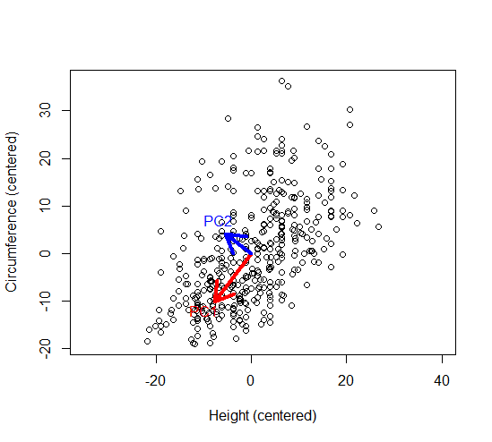

## Objectives of lecture

* Understand and implement Principal Component Analysis (PCA): a technique that transforms high-dimensional data into lower-dimensions while retaining as much information as possible.
* Example. Can reduce from 3 to 2 dimensions:
{#id .class width=60% height=60%}

## The principal components (PC.s)

{#id .class width=70% height=70%}

## Contents

* Linear combinations
* Principal components (PC's)
* Making sense of high dimensional data

## Linear Combinations

* Weighted sums of variables
* A new variable representing most of the information of others
* A very useful tool in the analysis of high-dimensional data
    + Exploration of data, generating hypotheses
    + Regression analysis when $p > n$ , i.e., more variables than cases
    + Regression analysis when predictor variables are collinear (correlation close to 1)

## The bodydata example

```{r, echo = F, message = FALSE}
library(mixlm); library(pls); library(BIAS.data)
```
```{r, echo = T, message = FALSE}
pairs(bodydata, lower.panel = NULL)
```


## A new "HeCirc" variable for predicting weight

* The variables Height and Circumference are correlated.

* They tell much of the same about a persons weight.

* Redundancy!?

* Let's make a new variable called "HeCirc" as the average of these:

$$HeCirc = 0.5*Height + 0.5*Circumference$$


## Height, Circumference and average (HeCirc)

```{r, echo = TRUE}
bodydata$HeCirc <- 0.5 * bodydata$Height + 
                   0.5 * bodydata$Circumference
head(bodydata[,c("Height", "Circumference", "HeCirc")])
```

## Centered variables, average subtracted


```{r, echo = TRUE}
# center = TRUE: subtracts average
# scale  = TRUE: gives variance = 1 
body2 <- as.data.frame(scale(bodydata, center = TRUE, 
                             scale = FALSE))
head(body2[,c("Height", "Circumference", "HeCirc")])
```

## About linear combinations: General case

* Assume there are $k$ random variables, $Z_1, Z_2, \ldots, Z_k$
and that these have been centered by
subtracting the mean. Ex: $X_1 = (Z_1 - \bar{Z_1})$.

* A standardized linear combination, $PC1$, is given by

$$PC1 = w_{11}X_1 + w_{12}X_2 + \cdots + w_{1k}X_k$$
where $\sum_j w_{1j}^2 = 1$. The $w_{ij}$'s are often called weights or loadings.

* In Principal Component Analysis we seek the $PC1$ with the largest variance .


## The first principal component PC1

$X_1$ = Height, $X_2$ = Circumference. The first principal component:

$$PC1 = -0.606 X_1 - 0.795 X_2$$

* Note that ${(-0.606)}^2+{(-0.795)}^2 = 1$

* This is the optimal combination of Height and Circumference and better than just
taking the average. It's optimal because the 
variance 
$$var(PC1) = \ldots  = 164.6$$ 
is maximal; all other linear combinations have smaller variance, i.e., explain less.


## Further components

* In PCA we seek further components which maximize variance but being orthogonal (at a right angle) to the previous components.

* The second component PC2 is

$$PC2 = w_{21}X_2 + w_{22}X_2 + \cdots + w_{2k}X_k$$

where $\sum_j w_{2j}^2 = 1$  AND $\sum_j w_{1j}\cdot w_{2j} = 0$.

It is given by:
$$PC2 = -0.795X_1 + 0.606X_2$$

Variance 
$$var(PC2) = 46.6$$

## PCA in R


```{r, echo = TRUE}
(pca1 <- prcomp(~ Height + Circumference, data = bodydata))
```


\begin{align*}
PC1 & = -0.606 X_1 - 0.795 X_2 \\
var(PC1) &= 12.828601^2 = 164.6 \\
PC2 & = -0.795 X_1 + 0.606 X_2 \\
var(PC2) &= 6.825743^2 =46.6 \\
\end{align*}


## Geometrical interpretation

```{r, fig.width = 4.2,fig.height = 4.2, echo = FALSE}
plot( body2$Height, body2$Circumference, pty = "s", asp = 1, 
      xlab = "Height (centered)", ylab = "Circumference (centered)")
arrows(0,0,pca1$sdev[1]*pca1$rotation[1,1],
       pca1$sdev[1]*pca1$rotation[2,1], col = 2,lwd = 4, lty = 1)
arrows(0,0,pca1$sdev[2]*pca1$rotation[1,2],
       pca1$sdev[2]*pca1$rotation[2,2], col = 4,lwd = 4)
text(-10,-12, "PC1", col = 2, lwd = 4)
text(-7,7, "PC2", col = 4, lwd = 4)
```

## Geometrical interpretation continued

* The longer red arrow of length SD(PC1) points in the direction
of the first principal component.
* The shorter orthogonal blue arrow of length SD(PC2) points in the direction of the second principal component.

## Mathematics I. PCA is by default based on the covariance matrix

```{r, echo = TRUE}
(covMat = cov(bodydata[,c("Height","Circumference")]))
```


## Mathematics II. Eigenvalues: variances. Eigenvectors: principal components

```{r, echo = TRUE}
eigen(covMat) # direction of eigenvectors arbitrary
```

* The eigenvalues  of the covariance matrix are
the variances of the principal components.
* The eigenvectors are the the principal components.

## Amount of explained variation

Each component "explains" an independent part of the original variability

```{r, echo = TRUE}
summary(pca1)
```

Computation: $12.83^2/(12.83^2 + 6.83^2) = 0.78$.

* Important information when we decide on how many principal components to keep, i.e., how much the dimension can be reduced. This can be plotted:

## The scree plot

```{r, echo = TRUE}
plot(pca1)
```


## The scores

The observed values for the PC's for each observation are called scores

```{r, echo = FALSE}
aa <- head(cbind(scale(bodydata[,c(2,4)],scale = FALSE),pca1$x),1)
colnames(aa) <- c("Height.Centered", "Circumference.Centered", "PC1", "PC2")
round(aa,3)
```
Check. Scores on PC1 and PC2 for first observation for covariance based PCA on centered data:

```{r, echo = TRUE}
-0.606 * 2.692 - 0.795 * (-5.408)
-0.795 * 2.692 + 0.606 * (-5.408)
```


## The score plot : observations


```{r, echo = TRUE}
scoreplot(pca1, main = 'Scoreplot', comps = c(1,2))
```

## Score plot. Above average tall colored red.

```{r, out.width = "80%"}
above <- ifelse(bodydata$Height > mean(bodydata$Height), 
                "red", "blue") 
scoreplot(pca1, comps = c(1,2), col = above)
```

## Identify observations

```{r, echo =  TRUE, eval  =  FALSE}
scoreplot(pca1, main = 'Scoreplot', 
          comps = c(1,2), identify = TRUE)
```

* We can find observations by clicking and look for extremes, clusters, patterns,...


## Scores for correlation based PCA

```{r, echo = TRUE}
pca.corr <- prcomp(~ Height + Circumference,
                   scale = TRUE, data = bodydata)
pca.corr$rotation # loadings
round(head(cbind(bodydata[,c(2,4)],pca.corr$x),1),3)
```


## How scores are calculated for correlation based PCA

* First standardise (mean = 0, SD = 1) variables for Height, Z1,
and Circumference Z2

```{r, echo = TRUE, message  =  FALSE}
attach(bodydata) #Allows Height for bodydata$Height
m1 <- mean(Height)
sd1 <- sqrt(var(Height))
m2 <- mean(Circumference)
sd2 <- sqrt(var(Circumference))
Z1 <- (Height-m1)/sd1; Z2 <-  (Circumference-m2)/sd2
PC1 = (-0.707) * Z1 + (-0.707) * Z2
PC2 = (-0.707) * Z1 + 0.707 * Z2         
c(PC1[1], PC2[1]) #Confirms scores on previous page
detach(bodydata) # turns of attach
```


## Example - The complete bodydata set

```{r, echo = TRUE}
pca2 <- prcomp(~ Age + Circumference + Height + Weight, 
               data = bodydata, center = T, scale = T)
print(pca2, digits = 3)
```

## Importance of original variables in PCA, the loadings

* The weights $w_{11} = 0.224, \ldots, w_{14} = 0.603$ are called the loadings for PC1.
* Large loadings indicate large contribution from a variable to the PC
* Variables with similar "information" (correlated) will have similar loadings.
* An overview of variable grouping and inter-dependence is quickly displayed in a loadings plot
* Plot of loadings from one component against another, e.g. for PC1 vs PC2, may be very informative.

## The loading plot: variables

```{r,echo = TRUE, out.width = "70%"}
loadingplot(pca2,  comps = c(1,2), 
            scatter = TRUE, labels = 'names')
```


## Biplot - Scores and loadings overlayed

```{r, echo = F}
set.seed(1729)
```

```{r, echo = TRUE}
foo  <-  prcomp(~ Age + Circumference + Height + Weight, 
    scale = T, center = T, data = bodydata[sample(1:407,50),])
biplot(foo, choices = c(1,2), cex = 0.60)
```


## Comments on plots

* Score plot: Shows observations. We look for simillar observations, clusters, patterns, deviating observations.
* Loading plot: Shows variables. As above, but for variables. If a principal component is interpreted 
(say for ranking), we can see the influence of different variables
* Biplot: combines the above plots.

* If the PC-s we are considering, typically the first two, explain a sufficient amount of the variablity, say 90%, interpretation may be promising.

## Example, the Track and Field data

National records (in minutes) on several running distances for 54 nations (men).

Distances: 100m , 200m , 400m, 800m, 1500m, 5000m, 10000m and marathon.

```{r, echo = TRUE}
head(TrackRecords,5)
```


## PCA - standardized variables

* One second is different for 100m and marathon:
  + When scales differ, we standardise variables so that variances are 1.
  + Equivalenty, we run PCA on the correlation matrix rather than the covariance matrix
  
```{r, echo = TRUE}
pca3 <- prcomp(~. , scale. = TRUE,   data = TrackRecords)
```


## The amount of variability explained

```{r, echo = TRUE}
aa <- summary(pca3)
round(aa$importance[, c(1, 2, 3, 8)], 4)
```

## Scree plot

```{r, echo = TRUE}
plot(pca3, main  = "")
```


## Loading plot

```{r, echo = TRUE, out.width = "70%"}
loadingplot(pca3, main = "", comps = c(1,2), 
            scatter = TRUE, labels = 'names')
```

This is more a picture of the correlation structure of the variables.


## Biplot

```{r, echo = TRUE}
biplot(pca3, choices = c(1,2), main = "", cex = 0.7)
```

## PC1 and PC2 explain most (92%) of the variability: may be interpreted

```{r, echo = TRUE}
pca3$rotation[,1:2]
```

* PC1: Weighted average, ranking of countries.
* PC2: Distinguishes short from long distances.

## Ranking countries  based on PC1

```{r, echo = TRUE}
PC1 <- pca3$x[,1]
X100m.Seconds <- 60*TrackRecords$X100m
records <- data.frame(TrackRecords, 
                      PC1 = PC1, X100m.Seconds)
ord <- order(PC1)
head(records[ord, c("PC1", "Marathon", "X100m.Seconds")])

```

